```{r setup, include=FALSE}
knitr::opts_chunk$set(echo=FALSE, warning=FALSE, message=FALSE)
```

```{r}
library(animbook)
library(tidyverse)
```


# Introduction {#intro}

The concept of "zombie companies" began to attract attention when @zombie_companies_2008 reported on their proliferation in Japan. Zombie companies are those with an interest coverage ratio of less than one for a period of more than three years, that is, companies taking space in the market but adding no life to the economy. We would detect their presence by a drop in performance, which is a movement pattern in their relative ranking over time. Generally, studying movement patterns is interesting for many problems, including rocket ship startups that rapidly perform well, or in politics, to study voters who switch party affiliation between elections. Viewing changes between categories over time is an interesting challenge for visualization.

The New York Times provided a possible solution in the article titled "Extensive data show punishing reach of racism for black boys" (@the_new_york_time) to tell the story of how racism appears to inhibit socioeconomic change. This animation is the motivation for the new visualization presented here, to be applied generally.
  
The challenge in producing an animation like that in New York Times article animation is the transformation of the data, and connection with elements of the plot that will be animated. The complexities include standardizing starting times of the temporal variable, allowing for the user to choose the number of categories, standardizing distributions and allowing the user to input pre-computed categorical data. These considerations provide the objective for creating an R package that can generalize the animation to suitably apply to a wide range of data.    
  
The structure of this paper is as follows. The next section explains the animation in The New York Times article and why it is relevant to the problem of studying zombie companies. The next section describes the expected data format. Following this is an explanation of available animation tools, and how they are employed for this problem. A section on the functions of the package and how the visualization is designed, demonstrates how the data is mapped to the animation. The last two sections illustrate the usage of the package and applications to company performance and changing political allegiance.


# Explanation of the New York Times visualization {#NYTvis}

```{r nyt, fig.cap="Screenshot of the New York Times animation, that is the motivation for this visualization package.", fig.width=8, fig.align='center', out.width="100%", layout = "l-page"}
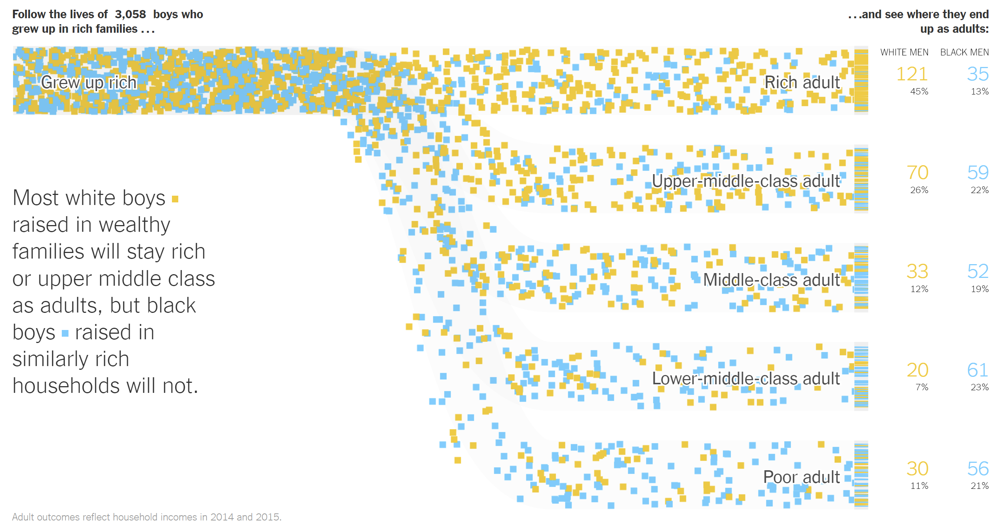
```

The interactive chart featured in the New York Times article (Figure \@ref(fig:nyt)) unveils the issue of income disparities between black and white children who were raised in families with comparable income according to the @race. This visualization reveals that, compared to white children, black children are more likely to drop down to the lower-income group, given that they both grew up in wealthy families.

  In the visualization, each observation is initially classified into one group at the start and potentially transitions into either the same group or a different group. This dynamics visualization constructs questions on the broader use of this visualization to other types of data. The potential use of this visualization on accounting data is to convey a message, as reported by the @oecd_report, that the concept of zombie companies is not unique to Japan alone. It is also present in the United States, which has a faster metabolize rate (more new listings and exits) relative to Japan.
  
  The political data that exhibits the movement of voters switching party affiliations between elections can be a valuable insight into the behavior of the voters. This data could be extended to incorporate demographic information about the voters, providing analysts with a significant insight into voter behavior. This allows them to consolidate effective campaigns for their political party. This also applies to marketing data, where customers shift their product interest to the competitor, providing the marketing analysts with an understanding of both the company's products and the overall market.

  This animation was developed using two software based on JavaScript, D3.js (@d3js), and WebGL (reference). The D3 JavaScript is one of the most widely known libraries for creating an interactive and dynamic visualization. It enables the designers to bind both the data and graphical elements to the DOM (Document Object Model). On the other hand, WebGL functions as a JavaScript API for rendering interactive 2D and 3D graphics within any compatible web browser without the use of plug-ins. For the animation in this paper, the programming language that will be used for recreating and revising the visualization done by The New York Times articles is R (@r).
  
  
# Data {#data}

Before any visualizations can be performed, the users must first understand the data concept known as `tidy data` (@tidy-data). There are three fundamental key principles: each variable forms a column, each observation forms a row, and each type of observational unit forms a table. These three keys are Codd's third normal form (@relational), but phrase in the language of statistics. The tidy data format focuses on a single dataset instead of many connected datasets typically found in a relational database.

```{r data-diagram, fig.cap="The data can be provided in the raw or categorized form, and will be processed into the format needed for the animation.", fig.width=8, fig.align='center', out.width="100%", layout = "l-page"}
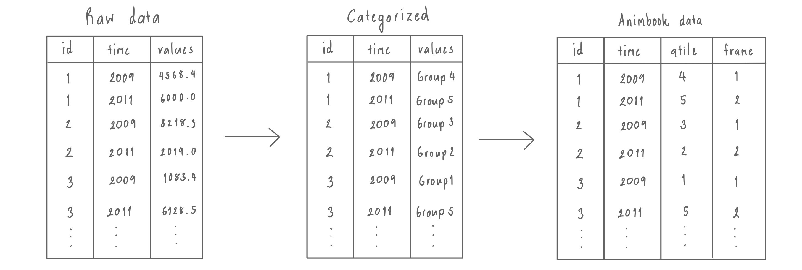
```
  
  In the data structure, there are requirements that must be followed for reproducing the animation. The data must have ID and time variables. These form what we call a unique ID. Also, the values variable can be either a numerical or categorical variable. The type of this variable will determine the stage the data set is in. This format ensures that during the data pre-processing, the R function understands what needs to be done with the data.
  
  Figure \@ref(fig:data-diagram) shows which stages the data is in, given the type of values variable. Start with the raw data structure. The values are presented in the numerical format. It is referred to as 'raw' because, in the New York Times animation, it is expressed in the categorical format. However, in most cases, the data is in numerical values and requires transformation. The second form is categorized data, as mentioned earlier, which involves transforming numerical into categories. 
This transformation may not be necessary if it already exists in the categorized format, as in the case of political data (party affiliation). The last form is animated data, where the frame is assigned to each unique ID.
  

# Animation tools {#animation}

```{r animation-diagram, fig.cap="The diagram shows how the animation is done using the successive pictures.", fig.width=8, fig.align='center', out.width="100%", layout = "l-page"}
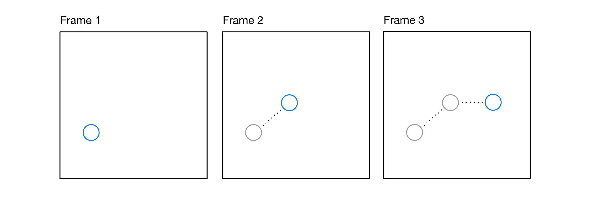
```

The principle underlying the animation is called persistence of vision (@animation-mechanic). When an image disappears, the brain will retain the previous images for a brief period of time. It is this slight period of retention that allows humans to separate sequential images. If this is seen in quick succession, it will appear as if the objects are in motion. This is illustrated in Figure \@ref(fig:animation-diagram). There are multiple ways to create an animation in the R environment (@r), including packages like `gganimate` and `Plotly`. 

  The `gganimate` package (@gganimate) is an extension from the `ggplot2` package (@ggplot2) to include the description of an animation. It added new grammar classes to the plot object, allowing it to understand how the plot should change over time. The use of `transition_*()` functions allows it to achieve this by specifying how the data evolves and how it relates to itself across time. The output from the `gganimate` can be rendered or saved in multiple formats. This includes `gifski_renderer()` from the `gifski` package (@gifski) to save the animation in GIF format or `av_renderer()` from the `av` package (@av) to save it into a video file format.

  Plotly is a graphing library that provides tools for creating an interactive plot in multiple programming languages, such as R, JavaScript, Python, and Julia. In R, plotly can be accessed through the `plotly` package (@plotly), which integrates plotly.js from the JavaScript graphing library. The usage of this library can be from a converting function, `ggplotly()`, or a standalone function, `plot_ly()`. The conversion is accomplished by taking the elements from the `ggplot` object and then redrawing them using the plotly.js.
  
```{r animated-diagram, fig.cap="The diagram shows how the frames were used in the animated plot.", fig.width=8, fig.align='center', out.width="100%", layout = "l-page"}
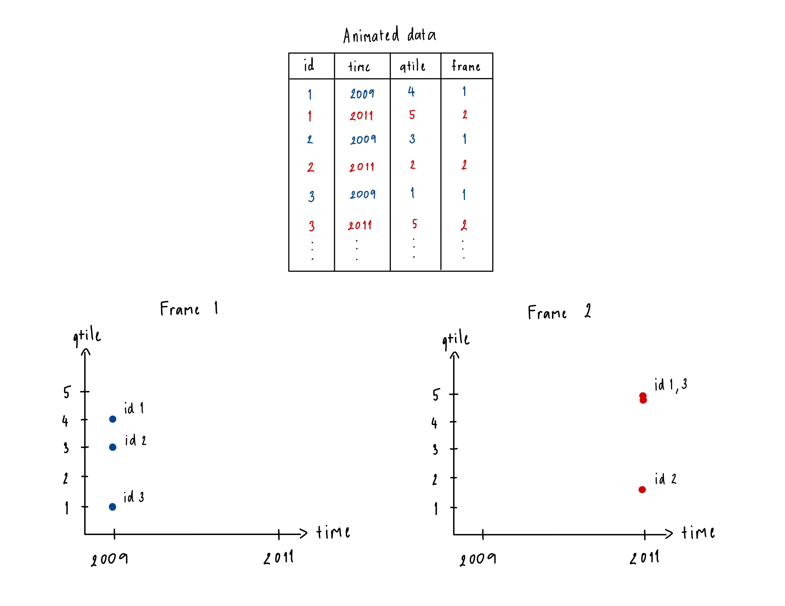
```
  
  In the context of data, as shown in Figure \@ref(fig:animated-diagram), observations are positioned at specific points in time. The further the distance between these points, the less smooth the animation becomes. This issue can be eliminated by interpolating additional points in between the observations. In the `gganimate` package (@gganimate), the interpolation is achieved using the `tweenr` package (@tweenr), while in `plotly`, it utilizes d3.interpolate (@d3js).
  
  Figure \@ref(fig:animated-diagram) demonstrates how the frame variables are applied in an animated plot. The frame variable within the animated data structure allows the animation function to determine the position of observations on the plot at any given frame.
  
  From @learner-control, it suggests that having control options for the animation can improve the efficiency of the learning process. Additionally, the length and speed of the animation should also be taken into consideration. According to @mayer-2010, the working memory, responsible for selecting and processing information from sensory memory, only holds a processed version of what was presented for generally less than thirty seconds.
  
  In `gganimate`, the issue of integrating controls can be addressed by setting the `renderer` argument to be `av_renderer()`, which allows the animation output to be in MP4 format. This format provides users with controls for the animation when opened on media applications provided in their systems. As for adjusting the length and speed of the animation, the `nframes` and `fps` arguments can be utilized. The `nframes` dictates the number of frames to be rendered, while `fps` controls how many frames are displayed in one second. Using these two parameters, the duration of the animation in seconds can be calculated as follows: length = nframes/fps.
  
  In the case of `plotly`, control integration is already implemented by default. The `frame` and `transition` arguments within the `animation_opts()` function can be specified to set the length and speed of the animation.
  
  
# Visualization design {#design}

The animated visualization can be an effective communication tool (@Mayer_Moreno_2002; @effective-trend). It helps with communicating complex data, enhancing the narrative, and keeping it engaged for the audience. According to @Mayer_Moreno_2002, animation can improve learning, especially when the goal is to promote deep understanding. 

  According to @mayer_2005, designing multimedia requires the designer to understand how people learn. One of the principles in @mayer_2005, Redundancy, suggests that a piece of excess information could overload the learners. By this principle, the animation must be carefully designed to avoid this pitfall.
  
  From the New York Times animation, multiple information are shown in the visualization. It includes points in motion, distribution at the end, and proportional counters. However, this could lead to information overload (@mayer_2005). Therefore, the distribution at the end and proportional counters are excluded. Instead, the new element has been integrated, proportional shaded areas. It displays the proportion of observation within each group.
  
```{r proportional-shade, fig.show="hold", out.width="50%", fig.cap="The plot shows the difference between the sigmoid and sine curves."}
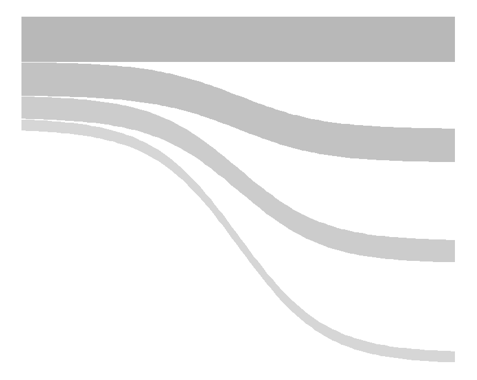
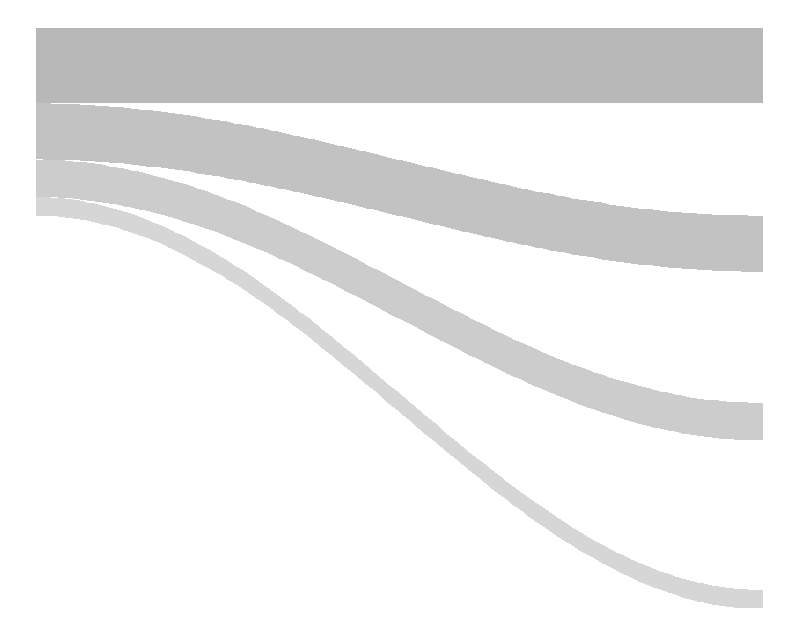
```
  
  As mentioned in the Animation tools section, the paths of observations are getting interpolated. These functions only generate a linear path between points. However, linear paths may not be suitable for creating proportional shading, as they do not accurately represent the proportions. Non-linear curves like the sigmoid curves should be considered instead, as they provide a better display of proportions. These curves are commonly used in multiple Sankey diagrams, but there is a limitation on this shape. The issue is shown in Figure \@ref(fig:proportional-shade). While it does accurately represent the proportion at the beginning and end, as it curves, the shape gets narrower, leading to less accurate proportion representation (@Shaffer_2019).

  
# Software {#software}

## Installation

You can install the development version of animbook from [GitHub](https://github.com/KrisanatA/animbook) with:

``` r
# install.packages("devtools")
devtools::install_github("KrisanatA/animbook")
```

## Overview of functions

In designing the package for reproducing the New York Times animated plot, the package ended up with a three-step process in recreating the animation. The first step is to turn the data into the right format for the plot function. The next stage is to create a ggplot object, which can then be inputted into the animation function. The last step is adding the animation settings to the ggplot object so the user can animate the plot using the `gganimate::animate()` function. The reason for this three-step process is that it allows the user who does not have a lot of experience to reproduce the animation while keeping the customization for an experienced user.

### Data preprocessing

From Figure \@ref(fig:data-diagram), there is a need to map numerical value to a category. One way to handle this is by ranking the sales and grouping the rankings into quantiles. In some cases, this may not be the best option. When the observation is moved up by quantile, one is bound to move down. This issue can be resolved by using an alternative method, which is grouping values based on their absolute values. Users may also be interested in grouping the data based on different demographics, for example, ranking within a specific country. This generalization leads to four different scaling methods for the numerical data. 

```{r}
original <- dbl_change |> 
  filter(id %in% c(1, 14, 21, 100, 106, 148)) |> 
  reframe(id, time, values, gp) |> 
  arrange(gp, id)

rank <- anim_prep(dbl_change, id, values, time, color = gp) 

rank_data <- rank$data |> 
  filter(id %in% c(1, 14, 21, 100, 106, 148)) |> 
  rename(gp = color,
         rank = qtile) |> 
  select(-frame) |> 
  arrange(gp, id)

absolute <- anim_prep(dbl_change, id, values, time, color = gp, scaling = "absolute") 

absolute_data <- absolute$data |> 
  filter(id %in% c(1, 14, 21, 100, 106, 148)) |>  
  rename(gp = color,
         absolute = qtile) |> 
  select(-frame) |> 
  arrange(gp, id)

rank_group <- anim_prep(dbl_change, id, values, time, color = gp, group_scaling = gp) 

rank_group_data <- rank_group$data |> 
  filter(id %in% c(1, 14, 21, 100, 106, 148)) |> 
  rename(gp = group,
         rank_group = qtile) |> 
  select(-c(frame, color)) |> 
  arrange(gp, id)
```

```{r}
absolute_group <- anim_prep(dbl_change, id, values, time, color = gp, group_scaling = gp, scaling = "absolute") 

absolute_group_data <- absolute_group$data |> 
  filter(id %in% c(1, 14, 21, 100, 106, 148)) |> 
  rename(gp = group,
         absolute_group = qtile) |> 
  select(-c(frame, color)) |> 
  arrange(gp, id)
``` 

```{r}
original |> 
  left_join(rank_data, by = c("id", "time", "gp")) |> 
  left_join(rank_group_data, by = c("id", "time", "gp")) |> 
  left_join(absolute_data, by = c("id", "time", "gp")) |> 
  left_join(absolute_group_data, by = c("id", "time", "gp")) |> 
  reframe(id, time, gp, values, rank, rank_group, absolute, absolute_group)
```

  1. Ranking by year. (rank)
  2. Ranking by year within a group. (rank_group)
  3. Fix bins relative to absolute values by year. (absolute)
  4. Fix bins relative to absolute values by year within a group. (absolute_group)


  For the first and second scaling methods, group splitting is executed using the `quantiles()` and `cut()` functions. The `quantile` function from the `stats` R package (@stats) takes a numeric vector and outputs the corresponding quantiles to the given probabilities. The output from the `quantile` function is then used as the `breaks` argument for the cut function that is part of the base R packages.

  In contrast, the third and fourth scaling methods calculate the quantile based on the absolute values scales. The default approach is to break the group equally using the `seq()` function. The `seq()` function takes input values from the minimum and maximum values and increments by equal steps depending on the number of groups of interest. Additionally, the users have the option to specify the breaks themselves if they choose to do so.
  
  These are only the initial steps in formatting the data into a category. Now that there is a method to transform the data from the raw into a categorized format, the next step is to modify it into an animated data structure. It is carried out by assigning the frame to each individual observation, ensuring that each ID does not contain repeat frame values. It lets the `gganimate` or `plotly` to perceive where the observation would be on the plot at a given frame as seen in the \@ref(fig:animated-diagram).
  
  The frame variable is assigned by sorting the data based on the ID and time using the `arrange()` function, followed by applying the `group_by()` function on the ID, allowing the `row_number()` function to be performed within each group. The functions mentioned in this paragraph are from the `dplyr` packages (@dplyr).
  
  All of the pre-processing steps mentioned above are completed using the `anim_prep()` or `anim_prep_cat()` function, depending on the stages of the data structure. The `anim_prep()` function is used for raw data format, while the `anim_prep_cat()` function is for categorized data format. There are additional arguments that facilitate the users for more customization.
  
  In the `anim_prep()` and `anim_prep_cat()`, there are required arguments that need to be specified. The lists are as follows:
  
  - data: A data frame containing the data to be prepared for visualization.
  - id: The column name that represents the unique identifier variable.
  - values: The column name that contains the numeric values to be visualized.
  - time: The column name represents the time variable.
  
  As shown previously, there are a total of four different scaling for the `anim_prep()` function. Both the use can customization of these scaling can be set using the following arguments:
  
  - ngroup:	The number of groups or categories to create for scaling values.
  - breaks: A vector of breaks for creating bins.
  - group_scaling: The column name that represents the grouping variable.
  - scaling: The scaling method to be used; "rank" or "absolute."
  
  For the `anim_prep_cat()` function, the arguments that allowed the user to order the category are by using this argument:
  
  - order: A vector of order for sorting the category values.
  
  Then, for further customization regarding how the final visualization looks. The following arguments can be adjusted:
  
  - label: A vector of labels to be used for the y-axis in the visualization.
  - color: The column name to be used in ggplot2::aes() for the plot function.
  - time_dependent: Logical. Should the visualization be time-dependent? Default is TRUE.
  - runif_min: The minimum value for random addition to frame numbers.
  - runif_max: The maximum value for random addition to frame numbers.


### Plotting function

Once the data is prepared. The next step is to create the `ggplot` object as a basis for the animation. There are three plots available in this package. Two of the plots could be used for the animation, and another plot is used as a static visualization. All of the plots have an internal function that converts the standard data format into the required structure for each plotting function. 

- `kangaroo_plot()`: plots the observation's movement over time.
- `wallaby_plot()`: the subset plot of the `kangaroo_plot` with the time limit to only start and end.
- `funnel_web_plot()`: the faceted static plot by time variable.


  The main focus of this paper will be on the `wallaby_plot()`, which draws inspiration from the New York Times animation and combines the knowledge gained from the previous sections in creating the visualization.

  The `wallaby_data()` function is responsible for performing data manipulation and formatting tasks on the original object. It includes creating additional data components for labeling and shading. This function also responds by interpolating the non-linear path. It performs this task by mapping the `sine()` function provided in this package to each observation using the `map()` function from the `purrr` package (@purrr). The frame is recalculated using the same method mentioned in the data preprocessing section. The `sankey_shade()` function is called to generate the proportional shaded data.

  
```{r shade-algorithm, fig.show="hold", out.width="50%", fig.cap="The plot shows how does the algorithm work."}
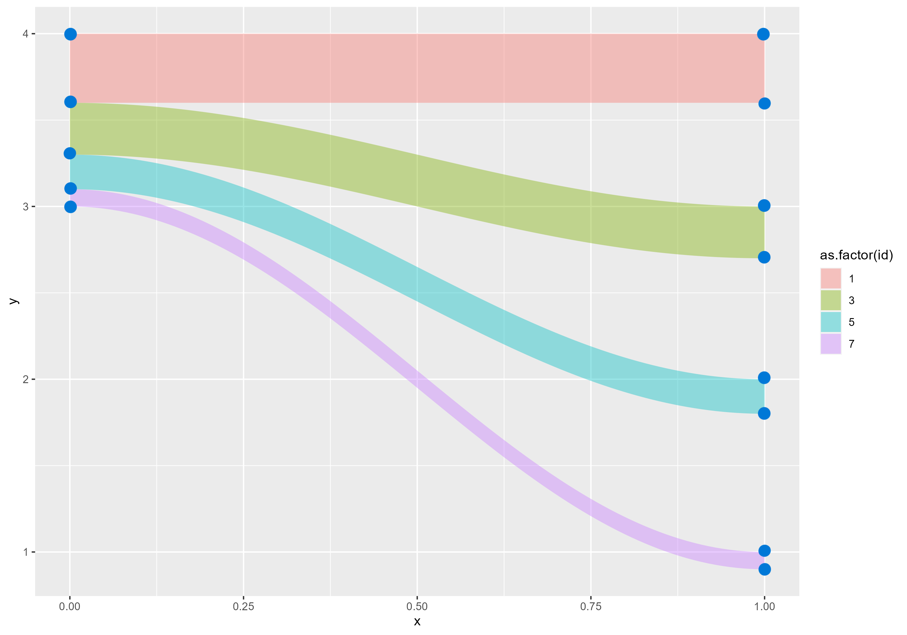
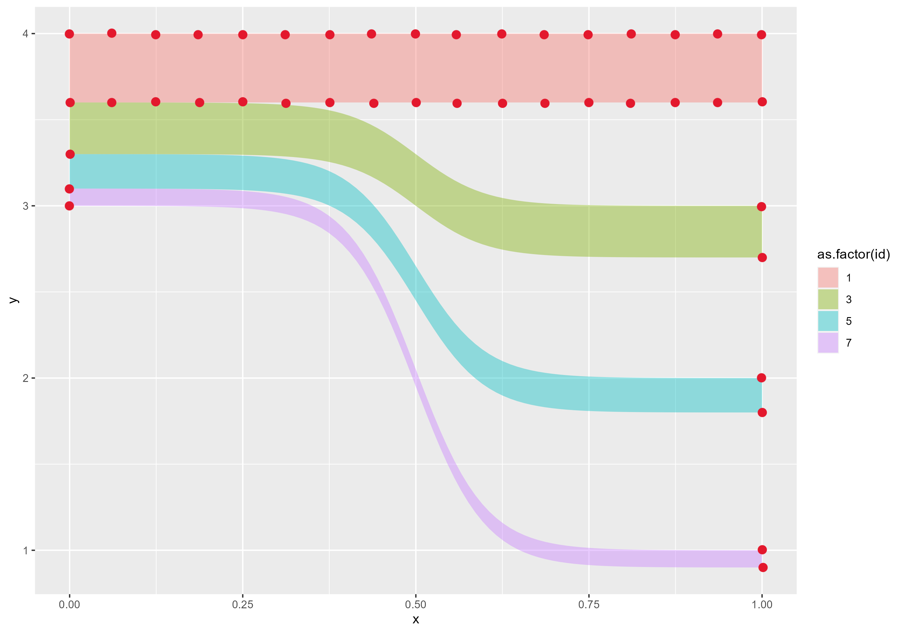
```
  
  The algorithm behind the `sankey_shade()` function is illustrated in Figure \@ref(fig:shade-algorithm). It started by calculating the corner points for all of the shaded areas. Then, use the `sine()` function to interpolate the point between the left and right. 
  
  Now that the data are in the right format for the wallaby's plot, the `geom_point()` function is used for plotting the observations, `geom_polygon()` is used for creating the proportional shaded areas, and `geom_text()` is used for creating labels. These three functions are from the `ggplot2` package (@ggplot2). During this process, the aesthetics mapping will be different depending on the rendering tool to be used, which can be either `gganimate` or `plotly`. The difference between the two rendering tools is that for `plotly`, the `ids` and `frame` arguments need to be specified during the creation of the `ggplot` object.
  
  The arguments for Wallaby's plot are as follows.
  - object: The animbook object returned from the prep function.
  - group_palette: The vector of the palette used by the function to supply the color to each group.
  - shade_palette: The vector of the palette used by the function to supply the color to the shaded area.
  - rendering: The choice of method used to create and display the plot, either gganimate or plotly.
  - subset: A character string specifying the variable used for subsetting the data. The "top" and "bottom" strings can also be used in this argument.
  - relation: The choice of relationship for the values to display on the plot, either "one_many." or "many_one."
  - total_point: The number of points the users want for the wallaby plot. Default is NULL, which is the number of points equal to the original.
  - height: The proportion of the area occupied by the observations in the shaded areas.
  - width: The distance between the first and last observation in the animation.
  - size: The point size.
  - alpha: The opacity of the proportional shaded areas.
  

### Animating function

It is necessary to save the plot as a `ggplot` object before passing it to the final function, `anim_animate()`, to animate. This function will automatically detect which rendering method was specified in the previous steps and add the minimum requirement functions accordingly. By default, if the user specifies the rendering as `gganimate`, then it will add the `transition_time()` function from the `gganimate` package (@gganimate). Otherwise, the `animation_opts()` function will be added from the `plotly` package (@plotly).


## Example usage

In this section, the package usage will be demonstrated using the `cat_change` dataset included in this package. This dataset is simulated data that has changed from category A to E between two time points. Since this data is already in the categorized data structure, the `anim_prep_cat()` function is utilized.

  The output produced from this package is referred to as the `animbook` object. This contained a list of data and settings that hold prepared data for visualization, along with a list of settings used in the plot function.

```{r, echo=TRUE}
animbook <- anim_prep_cat(cat_change, 
                          id = id, 
                          values = qnt, 
                          time = time, 
                          color = gp, 
                          time_dependent = FALSE)

head(animbook$data, 10)
str(animbook)
```

  To obtain a `ggplot` object for the animation function, the `wallaby_plot` is used. For further customization, the `shade_palette`, `subset`, and `relation` arguments are applied to define the final appearance of the animation.

```{r, echo=TRUE, fig.width=8, fig.align='center', out.width="100%", layout = "l-page"}
p <- wallaby_plot(object = animbook,
             group_palette = RColorBrewer::brewer.pal(9, "Set1"),
             shade_palette = c("#737373", "#969696", "#BDBDBD",
                               "#D9D9D9","#D9D9D9","#D9D9D9"),
             rendering = "ggplot",
             subset = "top",
             relation = "one_many",
             total_point = NULL)

p
```
  
  Once the `ggplot` object is obtained, the `anim_animate()` function can be used to transform it into a `gganimate` object. This then can be passed onto the `gganimate::animate()` function for rendering.

```{r, eval=FALSE}
p2 <- anim_animate(p)

gganimate::anim_save("figures/catchange.gif", p2, height = 8, fps = 30,
                     nframes = 400, width = 9, units = "in", res = 150)
```

``` r
p2 <- anim_animate(p)

gganimate::animate(p2)
```

```{r catchange-figure, fig.cap = "Animate visualization using example data.", fig.width=8, fig.align='center', out.width="100%", layout = "l-page", eval=knitr::is_latex_output()}
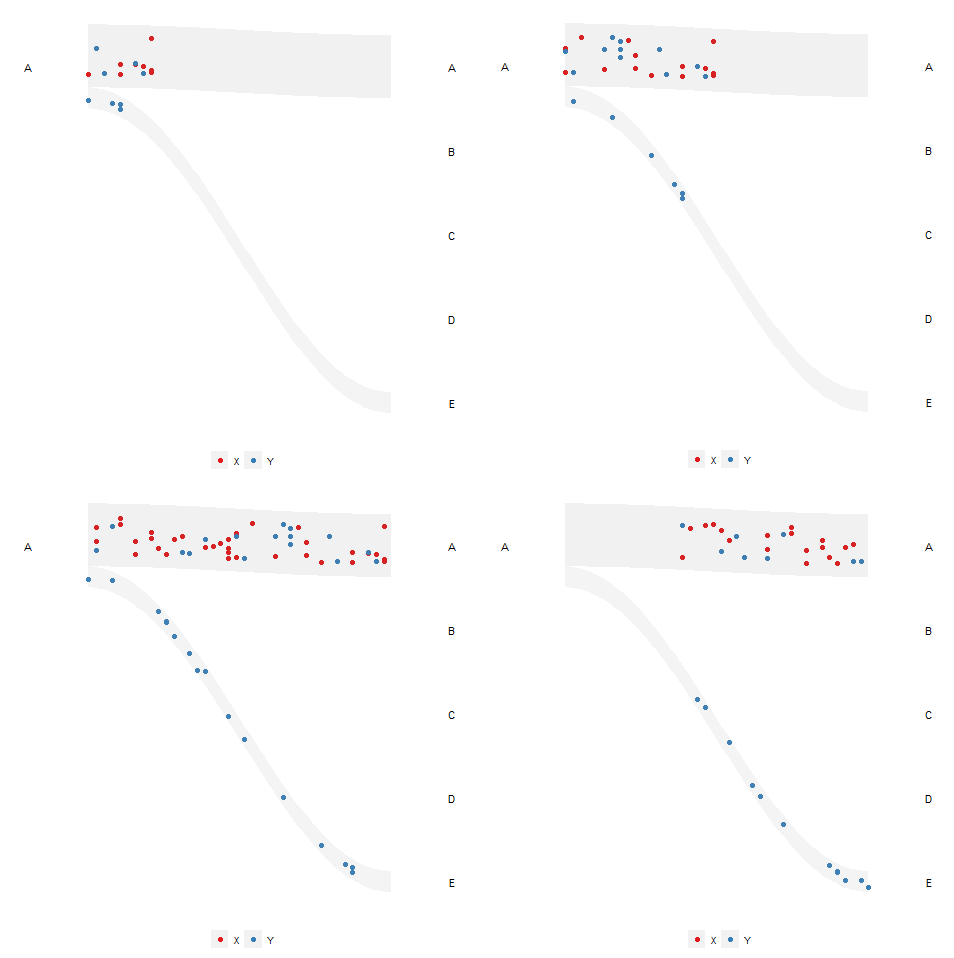
```


```{r catchange-gif, out.extra="class = 'gif'", fig.cap = "Animate visualization using example data.", eval=knitr::is_html_output()}
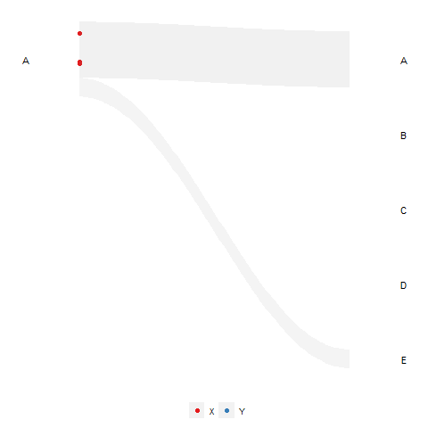
```

  This is an example of how the users can apply the three-step process in creating an animation plot using the `animbook` package. 


# Application

## Accounting database: osiris

The accounting Osiris data that will be used in this section was collected from Bureau van Dijk (@bvd). This data set comprises 30,000 rows and 94 variables of information on listed and major unlisted/delisted companies worldwide. The only variables of interest from this data set are ID, year, country, and sales. A subset version of this data set, which only contained variables of interest from 2006 to 2018, is included in this package.

  As mentioned in the OECD report (@oecd_report), the United States has a faster metabolize rate relative to Japan company. An animation will be created using the `animbook` package to enhance communication with data.

  First, filter the countries to include only the United States and Japan. Then, prepare the Osiris data using the `anim_prep` function with the first scaling, which is a ranking method. Next, use the `wallaby_plot` function to create a `ggplot` object and add default settings for `gganimate` rendering.

```{r, echo=TRUE}
data <- osiris |> 
  filter(country %in% c("US", "JP"))

label <- c("Top 25%", "25-50", "50-75", "75-100", "Not listed")

accounting <- anim_prep(data, 
                      id = ID, 
                      values = sales, 
                      time = year, 
                      label = label, 
                      ngroup = 4, 
                      color = country, 
                      time_dependent = FALSE)

p <- wallaby_plot(accounting,
                  group_palette = RColorBrewer::brewer.pal(9, "Set1"),
                  shade_palette = c("#737373", "#969696", "#BDBDBD",
                                    "#D9D9D9","#D9D9D9","#D9D9D9"),
                  subset = "bottom",
                  relation = "many_one",
                  height = 1,
                  size = 2,
                  width = 100,
                  total_point = 1000)

p2 <- anim_animate(p)
```

```{r, eval=FALSE}
gganimate::anim_save("figures/exit.gif", p2, height = 8, fps = 30,
                     nframes = 400, width = 9, units = "in", res = 150)
```

``` r
gganimate::animate(p2)
```

```{r osiris-figure, fig.cap = "The animate visualization shows the companies that exited the market. There are more United States companies that fall down into a not listed group compared to Japanese companies.", fig.width=8, fig.align='center', out.width="100%", layout = "l-page", eval=knitr::is_latex_output()}
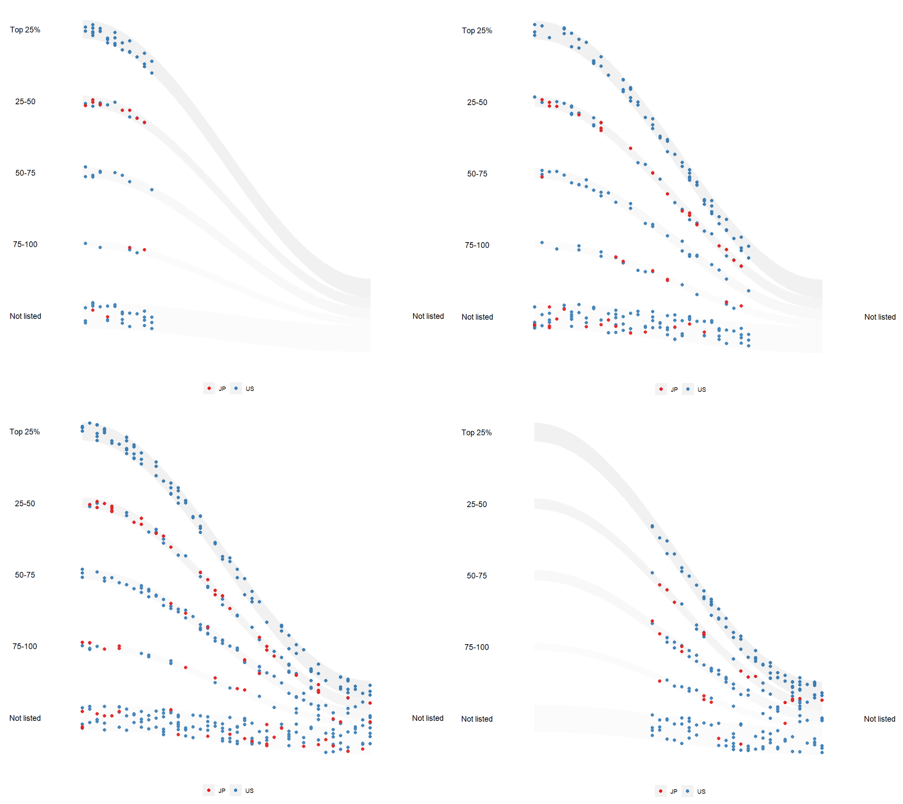
```

```{r osiris-gif, out.extra="class = 'gif'", fig.cap = "The animate visualization shows the companies that exited the market. There are more United States companies that fall down into a not listed group compared to Japanese companies.", eval=knitr::is_html_output()}
knitr::include_graphics("figures/exit.gif")
```

From the plot, a higher proportion of US companies have exited the market, confirming the OECD report (@oecd_report) that the United States has a higher turnover rate than Japan. An interesting finding is that all of the top 25% of companies that exited the market are only from the United States. It may be due to the absence of Japanese companies in the top 25% in 2006, or it could be that Japanese companies in the top 25% did not delist.


## Voter behavior

The Australian Election Study data was collected from ADA Dataverse (@aeles). The dataset included in the `animbook` package contains 1,468 rows and 4 variables of information: ID, year, party, and gender. This dataset comprises survey responses from the 2019 election. The year column was transformed from the two different questions to answer the question, based on the 2016 Australian election results, how the top party performs in keeping the old voters for different genders.

```{r, echo=TRUE}
voter <- anim_prep_cat(data = aeles,
                       id = id,
                       values = party,
                       time = year,
                       color = gender,
                       order = NULL,
                       time_dependent = FALSE)

p_voter <- wallaby_plot(object = voter,
                  group_palette = RColorBrewer::brewer.pal(9, "Set1"),
                  shade_palette = c("#737373", "#969696", "#BDBDBD",
                                    "#D9D9D9","#D9D9D9","#D9D9D9"),
                  rendering = "ggplot",
                  subset = "top",
                  relation = "one_many",
                  height = 1,
                  size = 2,
                  width = 100,
                  total_point = 1000)

p2_voter <- anim_animate(p_voter)
```

```{r, eval=FALSE}
gganimate::anim_save("figures/voter.gif", p2_voter, height = 8, fps = 30,
                     nframes = 400, width = 9, units = "in", res = 150)
```

``` r
gganimate::animate(p2_voter)
```

```{r voter-figure, fig.cap = "The animate visualization shows how does the top party perform in keeping the old voters for different genders. Most voters remain loyal to the party, but a small fraction of voters with roughly equal male-to-female ratio switch primarily to the other major party.", fig.width=8, fig.align='center', out.width="100%", layout = "l-page", eval=knitr::is_latex_output()}
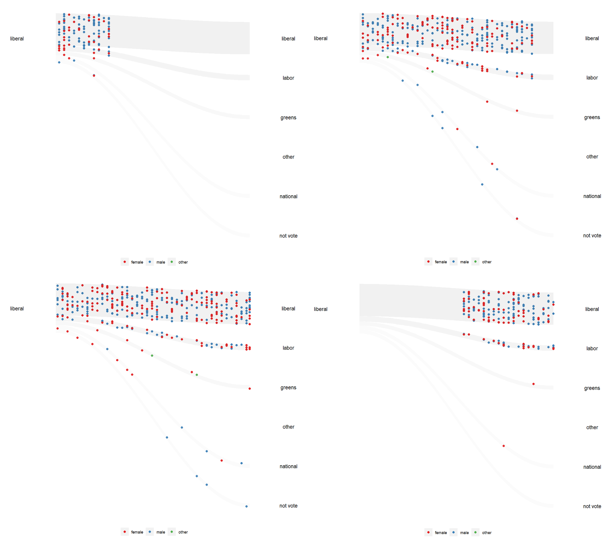
```

```{r voter-gif, out.extra="class = 'gif'", fig.cap = "The animate visualization shows how does the top party perform in keeping the old  voters for different genders. Most voters remain loyal to the party, but a small fraction of voters with roughly equal male-to-female ratio switch primarily to the other major party.", eval=knitr::is_html_output()}
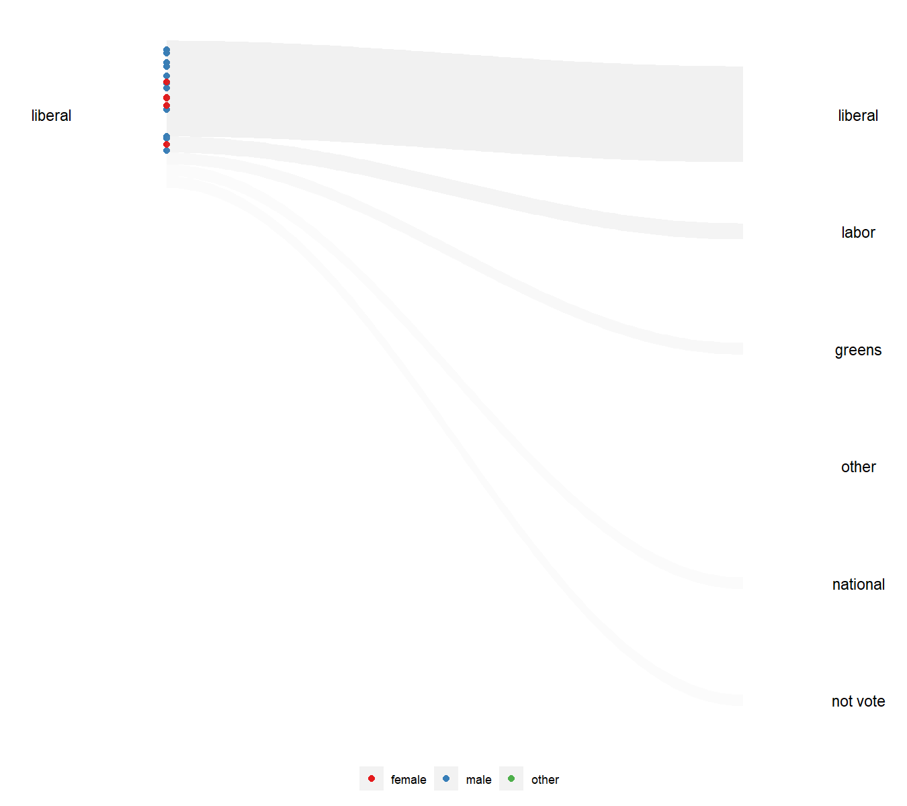
```

From the animation, it is clear that individuals who identified their gender as 'others' shifted their votes from the Liberal, the leading party in 2016, to the Greens party. These changes could be due to the Green Party's "A FAIRER, MORE EQUAL COMMUNITY" campaign, which advocates for full equality under the law and communities for LGBTIQ+ individuals. If the Liberal Party wishes to retain this demographic of voters, they may need to consider implementing a campaign focused on LGBTIQ+ issues.


# Summary

Beginning with inspiration from the New York Times articles, this package provides tools to facilitate the communication of complex data to general audiences. In the current version of `animbook`, the feature to have different speed for each observation have not yet been implemented. This feature will introduce a new dimension that allows the users to explore the data further. The plotly rendering is also not yet been optimized for use. Additionally, both new animated and static plots could also be added, as seen in the New York Times article (@the_new_york_time), to compare the demographics at a specific point in time. On top of that, the `cli` package (@cli) could be used for a more aesthetically pleasing command-line interface. 

# Acknowledgements {-}

This paper is created using the `rjtools` packages (@rjtools) and is based on the 0.0.0.9 version of the `animbook` package. This version is available on [GitHub](https://github.com/KrisanatA/animbook).

I also acknowledge the use of ChatGPT (https://chat.openai.com/) to paraphrase the sentence.
