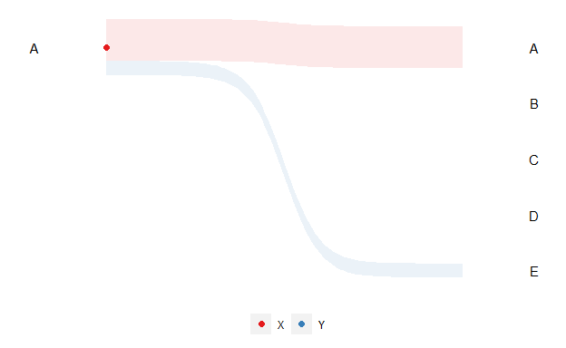

```{r setup, include=FALSE}
knitr::opts_chunk$set(echo = FALSE, warning = FALSE, message = FALSE)
```

```{r}
library(animbook)
library(tidyverse)
```

<!-- potential new title: animbook: Visualizing benchmark dynamics using animation, or animbook: Visualizing changes in benchmark using animation-->

# Introduction

The concept of "zombie companies" began to attract attention when an article on the proliferation of zombie companies  (@zombie_companies_2008). The "zombie companies" are generally defined as companies with an interest coverage ratio of less than one for a period of more than three years. However, there is a simpler and more easily understandable way to show these concepts by visualizing the new listings (enters) and the de-listing (exits) of publicly traded companies on a country-by-country basis. This visualization method makes it clear that the concepts of zombie companies are not unique to Japan, as indicated in the OECD report (@oecd_report) that the United States has a faster metabolize (more new listings and exits) relative to Japan.

  The visualization above can also be thought of as a movement between groups, which is how many companies have entered the market and how many have exited the market. One example of this visualization is from The New York Times article "Extensive data shows punishing reach of racism for black boys" (@the_new_york_time). The animation portrays the trajectory of how boys with different demographics could land up in society. It can be adapted to our problems by capturing the movement between the groups over a specific period.
  
  With an advancement in technology, this results in an increase in both the size and complexity of the data. It requires an experienced hand to convey the right messages from the data. However, as shown in The New York Times article (@the_new_york_time), the animation is not only created just for eye-catching graphics. Animation can be used as a tool that helps communicate complex data, enhancing the narrative and keeping it engaged for the audience. Based on @Mayer_Moreno_2002, animation can improve learning, especially when the goal is to promote deep understanding. It also requires the designer to understand how people learn. The cognitive theory of multimedia learning (@mayer_2005) will be considered during the designing period.
  
  The challenge of the New York Times article animation was the amount of code needed to reproduce. Additionally, the business data may or may not have the same information as the one in the article. These two purposes establish the objective for creating the R package that could generalize the animation to a wider range of data.
  
  The structure of this paper will consist of both the visualization design and software design. The first section will explain about the animation in The New York Times article. Secondly, what are the expected data to be input into the plot, and how it is processed. The third section is about the animation tools, for example, **gganimate** (@gganimate) and **plotly** (@plotly). The next section will be about the design of the package and visualization. The last two sections explore the usage of the R package and the application.
  

# Explanation of the New York Times visualization

The flow chart featured in one of the New York Time articles unveils the issue of income disparities between black and white children who were raised in families with comparable income according to the @race. This visualization reveals that, compared to white children, black children are more likely to drop down to the lower-income group, given that they both grew up in wealthy families. 

  In the visualization, each observation is initially classified into one group at the start and potentially transitions into either the same group or a different group. This dynamics visualization constructs questions on the broader use of this visualization to other types of data. As mentioned in the introduction, one of the data that will make use of this is accounting data. Additionally, the marketing data that exhibits the movement of customers shifting the product interest to another competitor can be valuable insight into the data. It could be extended to incorporate demographic information of the customers. It would allow the marketing analyst to gain a significant understanding of both the company's products and the overall market. This also applies to the election data for the analyst to consolidate the campaign for their political party.

  This animation was developed using two software based on JavaScript, D3.js (@d3js), and WebGL (reference). The D3 JavaScript is one of the most widely known libraries for creating an interactive and dynamic visualization. It enables the designers to bind both the data and graphical elements to the DOM (Document Object Model). On the other hand, WebGL functions as a JavaScript API for rendering interactive 2D and 3D graphics within any compatible web browser without the use of plug-ins. For the animation in this paper, the programming languages that will be used for recreating and revising the visualization done by The New York Times articles is R (@r).


# Data

Before any visualizations can be performed, the users must first understand the data concept known as `tidy data` (@tidy-data). There are three fundamental key principles: each variable forms a column, each observation forms a row, and each type of observational unit forms a table. These three keys are Codd's third normal form (@relational), but phrase in the language of statistics. The tidy data format focuses on a single dataset instead of many connected datasets typically found in a relational database.

  The accounting data that will be used in this section and in most of the examples for this paper was collected from Bureau van Dijk (reference). This data set comprises 30,000 rows and 94 variables of information on listed and major unlisted/delisted companies worldwide. The only variables of interest from this data set are ID, year, country, and sales. A subset version of this data set, which only contained variables of interest from 2006 to 2018, is included in this package.
  
  Now that the tidy data concept is established and the example data is introduced, let's explore how the data got transformed. As seen in the visualization, each observation is classified into a group. In the accounting data, however, it is represented in a numerical form instead of categories. The numerical value needs to be somehow mapped to a category. One way to handle this is by ranking the sales and grouping the rankings into quantiles. In some cases, this may not be the best option. As the observation is moved up by quantiles, one is bound to move down. It can be resolved by using an alternative method, which is grouping values based on their absolute values. Users may also be interested in grouping the data based on different demographics, for example, ranking within a specific country. This generalization leads to a total of four scaling methods for the numerical data.
  
  Original data:
  
```{r}
example <- osiris |> 
  filter(country %in% c("AU", "US"),
                between(year, 2006, 2007)) |> 
  arrange(desc(sales)) 

example |> 
  filter(ID %in% c("US751825172", "US470731996", "AU004085330", "AU009134114", "AU009219809", "US161229730")) |> 
  reframe(ID, year, sales, country) |> 
  arrange(ID)
```
  

1. Ranking by year.

```{r}
rank <- anim_prep(example, ID, sales, year, color = country)

rank$data |> 
  filter(id %in% c("US751825172", "US470731996", "AU004085330", "AU009134114", "AU009219809", "US161229730")) |> 
  rename(country = color) |> 
  select(-frame)
```


2. Fix bins relative to absolute values by year.

```{r}
absolute <- anim_prep(example, ID, sales, year, color = country, scaling = "absolute")

absolute$data |> 
  filter(id %in% c("US751825172", "US470731996", "AU004085330", "AU009134114", "AU009219809", "US161229730")) |> 
  rename(country = color) |> 
  select(-frame)
```


3. Ranking by year within a group.

```{r}
rank_group <- anim_prep(example, ID, sales, year, color = country, group_scaling = country)

rank_group$data |> 
  filter(id %in% c("US751825172", "US470731996", "AU004085330", "AU009134114", "AU009219809", "US161229730")) |> 
  rename(country = group) |> 
  select(-c(frame, color))
```


4. Fix bins relative to absolute values by year within a group (bug in code).

```{r}
absolute_group <- anim_prep(example, ID, sales, year, color = country, group_scaling = country, scaling = "absolute")

absolute_group$data |> 
  filter(id %in% c("US751825172", "US470731996", "AU004085330", "AU009134114", "AU009219809", "US161229730")) |> 
  rename(country = group) |> 
  select(-c(frame, color))
```
  
  For the first and third scaling methods, group splitting is executed using the `quantiles()` and `cut()` functions. The `quantile` function from the `stats` R package (@stats) takes a numeric vector and outputs the corresponding quantiles to the given probabilities. The output from the `quantile` function is then used as the `breaks` argument for the cut function that is part of the base R packages.
  
  In contrast, the second and fourth scaling methods calculate the quantile based on the absolute values scales. The default approach is to break the group equally using the `seq()` function. The `seq()` function takes input values from the minimum and maximum values and increments by equal steps depending on the number of groups of interest.

```{r data-diagram, fig.cap="The data transformation diagram.", fig.width=8, fig.align='center', out.width="100%", layout = "l-page"}
knitr::include_graphics("figures/data-diagram.png")
```

  Based on Figure \@ref(fig:data-diagram), these are only the initial steps in formatting the data into a category. Now that there is a method to transform the data from the raw into a categorized format, the next step is to modify it into an animbook data structure. It is carried out by assigning the frame to each individual observation, ensuring that each ID does not contain repeat frame values. Its lets the **gganimate** or **plotly** to perceive where the observation would be on the plot at a given frame.
  
  The frame variable is assigned by sorting the data based on the id and time using the `arrange()` function, followed by applying the `group_by()` function on the id, allowing the `row_number()` function to be performed within each group. The functions mentioned in this paragraph are from the `dplyr` packages (@dplyr).


# Animation tools

Literature review of animation tools


# Visualization design

This explains how to get from data to the animations, including different sorts of plots.


  

# Software

## Installation

## Overview of functions

In designing the package for reproducing the New York Times animated plot, the package ended up with a three-step process in recreating the animation. The first step is to turn the data into the right format for the plot function. The next stage is to create a ggplot object, which can then be inputted into the animation function. The last step is adding the animation settings to the ggplot object so the user can animate the plot using the `gganimate::animate()` function. The reason for this three-step process is that it allows the user who does not have a lot of experience to reproduce the animation while keeping the customization for an experienced user.


### Prepare the data

The first step can be done using the `anim_prep()` function. This function required that the user data contained ID, which is used to identify each individual observation, values, which are numerical values to be used to group the observation together, and time, the variable associated with the changes of the observation. In the cases when the users already have the values as a group variable, the `anim_prep_cat()` function can then be used instead.

```{r}
animbook <- anim_prep(osiris, ID, sales, year)

animbook_cat <- anim_prep_cat(d_w_change, id, qnt, time)
```

The additional options for the `anim_prep()` that allow for more customization to the data structure or the plot are as follows:

- label: group labeling.
- ngroup: number of groups we want to split the values into.
- breaks: the group bins' size
- group_scaling: the grouping variable for the bins calculations.
- color: the variable used to color the observations.
- time_dependent: logical. Whether we want the observations to start at the same time or not.
- scaling: the scaling method, either `rank` or `absolute`.
- runif_min: minimum value for random addition to frame numbers
- runif_max: maximum value for random addition to frame numbers

Using the different combinations of the additional options, the users could end up with four different scales, as mentioned in the \@ref(data) section.

1. Rank scaling

```{r}
# rank scaling
rank_scaling <- anim_prep(data = osiris, id = ID, values = sales, time = year)
```

2. Absolute scaling

```{r}
# absolute scaling
absolute_scaling <- anim_prep(data = osiris, id = ID, values = sales, time = year, 
                              scaling = "absolute")
```

3. Rank scaling by group

```{r}
# rank scaling by group
rank_scaling_group <- anim_prep(data = osiris, id = ID, values = sales, time = year,
                                group_scaling = country)
```

4. Absolute scaling by group

```{r}
# absoluate scaling by group
absolute_scaling_group <- anim_prep(data = osiris, id = ID, values = sales, time = year,
                                    group_scaling = country, scaling = "absolute")
```


For the `anim_prep_cat()` function, the additional options are:

- label: group labeling.
- order: the ordering of the group.
- color: the variable used to color the observations.
- time_dependent: logical. Whether we want the observations to start at the same time or not.
- runif_min: minimum value for random addition to frame numbers
- runif_max: maximum value for random addition to frame numbers

Both the `anim_prep()` and `anim_prep_cat()` functions will return the "animbook" object containing a list of the standard format data and settings.


### Plotting the data

Once the data is prepared. The next step is to create the ggplot object as a basis for the animation. There are three plots available in this package. Two of the plots could be used for the animation, and another plot is used as a static visualization.

- `kangaroo_plot()`: plots the observation's movement over time.
- `wallaby_plot()`: the subset plot of the `kangaroo_plot` with the time limit to only start and end.
- `funnel_web_plot()`: the faceted static plot by time variable.

All of the plots have an internal function that converts the standard data format into the required structure for each plotting function. 

```{r}
animbook <- anim_prep_cat(data = d_w_change, id = id, values = qnt, time = time, color = gp)
```


1. Kangaroo's plot

```{r, out.width="70%"}
# kangaroo plot
kangaroo_plot(object = animbook,
              palette = RColorBrewer::brewer.pal(9, "Set1"), 
              rendering = "ggplot")
```


2. Wallaby's plot

```{r, out.width="70%"}
# wallaby plot
wallaby_plot(object = animbook,
             group_palette = RColorBrewer::brewer.pal(9, "Set1"),
             shade_palette = RColorBrewer::brewer.pal(9, "Set1"),
             rendering = "ggplot",
             subset = "top",
             relation = "one_many",
             total_point = NULL)
```


3. Funnel web spider's plot

```{r, out.width="70%"}
# funnel web plot
funnel_web_plot(object = animbook,
                palette = RColorBrewer::brewer.pal(9, "Set1"),
                rendering = "ggplot")
```


### Animating the plot

To animate the plot, the plot need to be save as an object before passed on to the final function `anim_animate()`.

```{r}
# animate <- anim_prep_cat(d_w_change, id = id, values = qnt, time = time, color = gp, time_dependent = FALSE)
# 
# p <- wallaby_plot(animate)
# 
# p2 <- anim_animate(p)
# 
# gganimate::anim_save("figures/dwchange.gif", p2)
```

```{r}
# 
```

```{r dwchange-gif, out.extra="class = 'gif'", fig.cap = "Something", eval=knitr::is_html_output()}

```

## Example usage


# Application

## Accounting database: osiris

```{r}
# raw_data <- read_csv("data-raw/osiris2021-sample1000.csv")

# filter the data with sales record in selected period (2009 - 2018)

# data <- raw_data |>
#   filter(year >= 2000 & year < 2020,
#         country %in% c("US", "JP", "CN")) |>
#   select(year, country, ID, sales) |>
#   filter(!is.na(sales) & sales != 0)
# 
# country <- data |>
#   select(ID, country) |>
#   distinct()
# 
# # complete the data using complete function for the missing year
# complete_data <- data |>
#   select(-country) |>
#   tidyr::complete(year, ID) |>
#   left_join(country) |>
#   mutate(ID = as.factor(ID),
#         year = as.integer(year))
# 
# label <- c("Top 25%", "25-50", "50-75", "75-100", "Not listed")
# 
# animbook <- anim_prep(osiris, ID, sales, year, label = label, ngroup = 4, color = country, time_dependent = FALSE)
# 
# ptop <- wallaby_plot(animbook, subset = "bottom", relation = "many_one", total_point = 500)
# 
# ptop2 <- anim_animate(ptop)
# 
# gganimate::animate(ptop2)
# 
# pbottom <- wallaby_plot(osiris, subset = "bottom", relation = "one_many", total_point = 500)
# 
# pbottom2 <- anim_animate(pbottom)
# 
# gganimate::animate(pbottom2)
# 
# gganimate::anim_save("inst/new_visualisation/exit.gif", ptop2, height = 8,
#                      width = 9, units = "in", res = 150)
# 
# gganimate::anim_save("inst/new_visualisation/enter.gif", pbottom2, height = 8,
#                      width = 9, units = "in", res = 150)
```


## Voter behavior

Based on the 2016 Australian election results, how does the top party perform in keeping the old voters for different genders.

```{r}
# object <- anim_prep_cat(data = aeles,
#                         id = id,
#                         values = party,
#                         time = year,
#                         color = gender,
#                         order = NULL,
#                         time_dependent = FALSE)
# 
# # subset can be either "top", "bottom" or values in the data
# # many_one not working yet
# 
# p <- wallaby_plot(object = object,
#                   group_palette = RColorBrewer::brewer.pal(9, "Set1"),
#                   shade_palette = RColorBrewer::brewer.pal(9, "Set1"),
#                   rendering = "ggplot",
#                   subset = "top",
#                   relation = "one_many",
#                   height = 1,
#                   size = 3,
#                   width = 100,
#                   total_point = 1000)
# 
# p2 <- anim_animate(p)
# 
# gganimate::animate(p2)
```


<!-- To look for the flow between group, one of the most common tools we look at is sankey chart. It represent the movement of the values from one set to another. However, with the static sankey, the only information presented are what is the proportion of the movement, and which states the quantities move to, this often enough in explaining the flow and helps making the decision necessary. To present more information, color could be used to represent the demographic of the group. What if the information that are interesting lies in the times domain, how could the plot captured that information?

!!general sankey plot and sankey with color 

The technique that is created by Hans, Ola, and Anna Rosling in 2003 is called Gapminder Trendalyzer. Its add an additional dimensions which are the bubble size, animated over changes in a fourth dimension, time. The animation in this tools has created a new way for people to analyse and visualize the trend. 

!!read effectiveness of animation in trend visualization, then add more information to above paragraph

The osiris data from Bureau van Dijk, contains an information on listed, and major unlisted/delisted companies across the world. This is one of an example of accounting data, where the objective is to observed the movement of the company between the quantile and how japan companies are ranked compared to others.-->


<!-- # Operation and data type abstraction

When working with the raw data, the data pre-processing is one of the important steps we need to take before further analysis is taken. The function in this package will offer some flexibility in the types of the variable it accepted. However, there are still some restrictions the user needs to follow. In this section, it will provide what are the accepted format and examples for the user the followed to reproduce the final animate plot.

The data set that will be used in this section and in all of the examples of this paper is collected from Bureau van Dijk. The data set contained 30,000 rows and 94 variable of information on listed, and major unlisted/delisted companies across the world. From the raw data, we are only interested in the ranking of the companies. The cleaned version of this data set is included in the package which only contained the relevant variables to reproduce the animated plot.
-->


<!-- Introduction

Some ideas:

- The animated plot has not been used often in the business data presentation
- We want to see the movement of our variable of interest
- Business data: Accounting data (sales), Marketing data (customer interest), data analysis languages data
- Help with storytelling
- Inspiration: The New York Times (Extensive data shows punishing reach of racism for black boys). The animation plot shows what demographic group between white and black boys where would end up in society. It could be adapted to show, based on the demographic of the company, sees the movement of where they would end up. In the marketing data, the demographic of the customers could tell us the story of what product they preferred.


Data and Process

Some ideas:

- The data will need a following structure for it to be ready to plot: time index(time variable for the gganimate), x-axis for ggplot(this does not need to be the same as time index), key(unique identifier), rank(y-axis, factor variable), group(optional).

- The user can input any numerical, categorical and factor variable into the prep_anim function which will return the data in the format that the anim_plot function accepted. The x-axis and time index does not need to be the same as this allows for the user to reproduce the nytimes plot which is not time dependent. For the rank variable, no matter what the type of variable is in, it will return numerical variable.


When working with the raw data, the data pre-processing is one of the important steps we need to take before further analysis is taken. The function in this package will offer some flexibility in the types of the variable it accepted. However, there are still some restrictions the user needs to follow. In this section, it will provide what are the accepted format and examples for the user the followed to reproduce the final animate plot.

The data set that will be used in this section and in all of the examples of this paper is collected from Bureau van Dijk. The data set contained 30,000 rows and 94 variable of information on listed, and major unlisted/delisted companies across the world. From the raw data, we are only interested in the ranking of the companies. The cleaned version of this data set is included in the package which only contained the relevant variables to reproduce the animated plot.

- The data structure
- The steps for the user
- How does the function processes the data
-->


