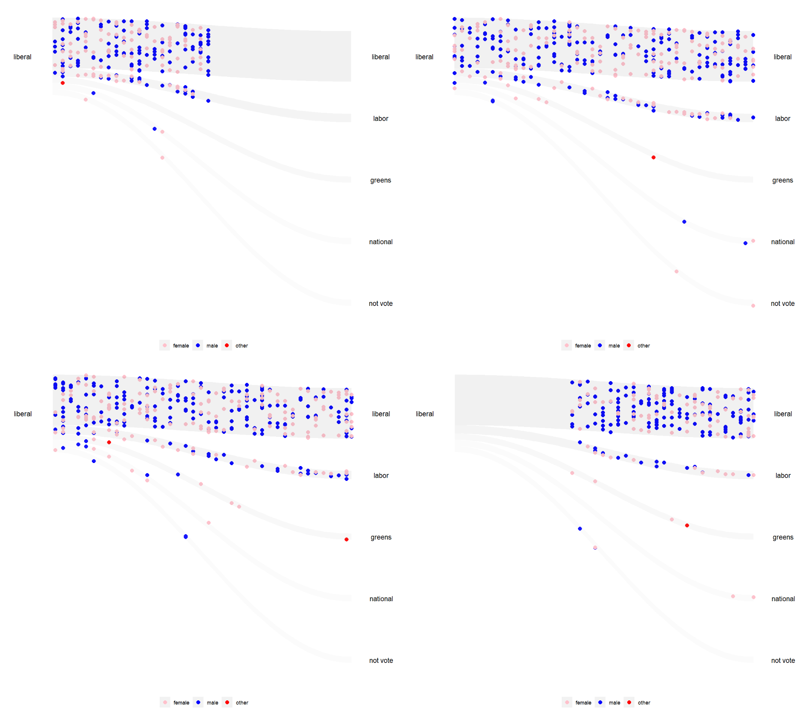

```{r setup, include=FALSE}
knitr::opts_chunk$set(echo=FALSE, warning=FALSE, message=FALSE)
```

```{r}
library(animbook)
library(tidyverse)
```


# Introduction {#intro}

The concept of "zombie companies" began to attract attention when @zombie_companies_2008 reported on their proliferation in Japan. Zombie companies are those with an interest coverage ratio of less than one for a period of more than three years, that is, companies taking space in the market but adding no life to the economy. We would detect their presence by a drop in performance, which is a movement pattern in their relative ranking over time. Generally, studying movement patterns is interesting for many problems, including rocket ship start-ups that rapidly perform well or in politics, to study voters who switch party affiliation between elections. Viewing changes between categories over time is an interesting challenge for visualization.

  The New York Times provided a possible solution in the article titled "Extensive data show punishing reach of racism for black boys" (@the_new_york_time) to tell the story of how racism appears to inhibit socioeconomic change. This animation is the motivation for the new visualization presented here to be applied generally.
  
  The challenge in producing an animation like that in the New York Times article animation is the transformation of the data and connection with elements of the plot that will be animated. The complexities include allowing the user to choose the number of categories, standardizing distributions, and allowing the user to input pre-computed categorical data. These considerations provide the objective for creating an R package that can generalize the animation to suitably apply to a wide range of data.    
  
  The structure of this paper is as follows. The next section explains the animation in The New York Times article and why it is relevant to the problem of studying zombie companies. The next section describes the expected data format. Following this is an explanation of available animation tools and how they are employed for this problem. A section on the functions of the package and how the visualization is designed demonstrates how the data is mapped to the animation. The last two sections illustrate the usage of the package and applications to company performance and changing political allegiance.


# Explanation of the New York Times visualization {#NYTvis}

```{r nyt, fig.cap="Screenshot of the New York Times animation, which is the motivation for this visualization package.", fig.width=8, fig.align='center', out.width="100%", layout = "l-body"}
knitr::include_graphics("figures/NYT.png")
```

The interactive chart featured in the New York Times article (Figure \@ref(fig:nyt)) unveils the issue of income disparities between black and white children who were raised in families with comparable income according to the @race. This visualization reveals that, compared to white children, black children are more likely to drop down to the lower-income group, given that they both grew up in wealthy families.

  In the visualization, each observation is initially classified into one group at the start and potentially transitions into either the same group or a different group. This dynamics visualization constructs questions on the broader use of this visualization to other types of data. The potential use of this visualization on accounting data is to convey a message, as reported by the @oecd_report, that the concept of zombie companies is not unique to Japan alone. It is also present in the United States, which has a faster metabolize rate (more new listings and exits) relative to Japan.
  
  The political data that exhibits the movement of voters switching party affiliations between elections can be a valuable insight into the behavior of the voters. This data could be extended to incorporate demographic information about the voters, providing analysts with a significant insight into voter behavior. This allows them to consolidate effective campaigns for their political party. This also applies to marketing data, where customers shift their product interest to the competitor, providing the marketing analysts with an understanding of both the company's products and the overall market.

  This animation was developed using the software based on JavaScript, D3.js (@d3js), and WebGL (@webgl). The D3 JavaScript is one of the most widely known libraries for creating an interactive and dynamic visualization. It enables the designers to bind both the data and graphical elements to the DOM (Document Object Model). On the other hand, WebGL functions as a JavaScript API for rendering interactive 2D and 3D graphics within any compatible web browser without the use of plug-ins. For the animation in this paper, the programming language that will be used for recreating and revising the visualization done by The New York Times articles is R (@r).
  
  
# Data {#data}

```{r data-diagram, fig.cap="The animation expects data with an ID and a time variable, along with a numerical variable (raw form), which is possibly converted to categorical (categorized). The data can be provided in the raw or categorized form and will be processed into the format needed for the animation, where the categorical variable is treated as a quantile and an animation frame variable is created.", fig.width=8, fig.align='center', out.width="100%", layout = "l-body"}
knitr::include_graphics("figures/data-diagram.png")
```

In the data structure, there are requirements that must be followed for reproducing the animation. First, the data set needs to be in the `tidy data` format (@tidy-data). The data then must have at least ID and time variables, in addition to the measured variables, which would usually be numeric but can also be categorical as well. The ID variable indicates the individual, which is followed over time, such as the company name. There may also be a grouping variable, such as the country where the company is registered.

  Figure \@ref(fig:data-diagram) illustrates the expected format of the data and variables created to prepare it for the animation. We start with the raw data structure. The values are presented in the numerical format, which we call the 'raw' form. In most cases, the measured variable will be numerical and require transformation. The second form is categorized data, which involves transforming numerical variables into categories, typically quantiles. This transformation may not be necessary if it is already provided in the categorized format. The last form is animated data, where the frame is assigned to each unique ID.


# Animation tools {#animation}

```{r animation-diagram, fig.cap="The diagram shows how the animation is done using the successive pictures. When small changes are seen in quick succession, it will appear as if the objects are in motion.", fig.width=8, fig.align='center', out.width="100%", layout = "l-body"}
knitr::include_graphics("figures/animation-diagram.png")
```

A principle important for designing a useful animation is called persistence of vision (@animation-mechanic). When an image disappears, the brain will retain the previous images for a brief period of time. It is this slight period of retention that allows humans to separate sequential images. If this is seen in quick succession, it will appear as if the objects are in motion. This is illustrated in Figure \@ref(fig:animation-diagram).

  There are multiple ways to create an animation in the R environment (@r), including the packages \CRANpkg{gganimate} (@gganimate) and \CRANpkg{plotly} (@plotly).
  
  The \CRANpkg{gganimate} package is an extension from the \CRANpkg{ggplot2} package (@ggplot2) to include the description of an animation. It added new grammar classes to the plot object, allowing it to understand how the plot should change over time. The use of `transition_*()` functions allows it to achieve this by specifying how the data evolves and how it relates to itself across time. This includes `gifski_renderer()` from the \CRANpkg{gifski} package (@gifski) to save animation in GIF format or `av_renderer()` from the \CRANpkg{av} package (@av) to save it into a video file format.
  
  The `plotly` software is a graphic library that provides tools for creating an interactive plot in multiple programming languages, such as R, JavaScript, Python, and Julia. In R, plotly can be accessed through the \CRANpkg{plotly} package, which integrates plotly.js from the JavaScript graphing library. The usage of this library can be from a converting function, `ggplotly()`, or a standalone function, `plot_ly()`. The conversion is accomplished by taking the elements from the `ggplot` object and then redrawing them using the plotly.js.
  
```{r animated-diagram, fig.cap="The diagram shows how the frames were used in the animated plot. Frame one is depicted in blue, and frame two is represented in red. Each blue component is mapped exclusively to the Frame 1 plot, while all the second-frame elements are excluded, and vice versa.", fig.width=8, fig.align='center', out.width="100%", layout = "l-body"}

```

  In the context of data, as shown in Figure \@ref(fig:animated-diagram), observations are positioned at specific points in time. The further the distance between these points, the less smooth the animation becomes. This issue can be eliminated by interpolating additional points in between the observations. In the \CRANpkg{gganimate} package, the interpolation is achieved using the \CRANpkg{tweenr} package (@tweenr), while in \CRANpkg{plotly}, it utilizes d3.interpolate (@d3js).
  
  Figure \@ref(fig:animated-diagram) demonstrates how the frame variables are applied in an animated plot. The frame variable within the animated data structure allows the animation function to determine the position of observations on the plot at any given frame.
  
  From @learner-control, it suggests that having control options for the animation can improve the efficiency of the learning process. Additionally, the length and speed of the animation should also be taken into consideration. According to @mayer-2010, the working memory, responsible for selecting and processing information from sensory memory, only holds a processed version of what was presented for generally less than thirty seconds.
  
  In \CRANpkg{gganimate}, the issue of integrating controls can be addressed by setting the `renderer` argument to be `av_renderer()`, which allows the animation output to be in media applications provided in their systems. As for adjusting the length and speed of the animation, the `nframes` and `fps` arguments can be utilized. The `nframes` dictates the number of frames to be rendered, while `fps` controls how many frames are displayed in one second. Using these two parameters, the duration of the animation in seconds can be calculated as follows: length = nframes/fps.
  
  In the case of \CRANpkg{plotly}, control integration is already implemented by default. The `frame` and `transition` arguments within the `animation_opts()` function can be specified to set the length and speed of the animation.
  

# Visualization design {#design}

The animated visualization can be an effective communication tool (@Mayer_Moreno_2002; @effective-trend). It helps with communicating changing data values, enhancing the narrative, and keeping it engaging for the audience. According to @Mayer_Moreno_2002, animation can improve learning, especially when the goal is to promote deep understanding.

  @mayer_2005 states that designing multimedia requires the designer to understand how people learn. One of the principles in @mayer_2005, Redundancy, suggests that a piece of excess information could overload the learners. By this principle, the animation must be carefully designed to avoid this pitfall.
  
```{r proportional-shade, fig.show="hold", out.width="50%", fig.cap="The plot shows the difference between the sigmoid (shown in the left figure) and the sine curve (shown in the right figure). In the sigmoid, as the curve progresses, it becomes narrower, resulting in a less accurate representation of proportions compared to the sine curve."}
knitr::include_graphics("figures/sigmoid-shade.png")
knitr::include_graphics("figures/sine-shade.png")
```

  In the animation, the proportional shaded area has been incorporated to facilitate a quick grasp of the proportion information. It displays the proportion of observation within each group. The design also needs to account for situations where the visualization lacks an adequate number of data points. In such cases, it can be challenging to visually discern the movement pattern of the subgroup, requiring the implementation of observation interpolation.
  
  The paths of observations need to be interpolated to create small changes in the position of points to produce the appearance of motion, as mentioned in the Animation tools section. These interpolate functions in \CRANpkg{gganimate} and \CRANpkg{plotly} only generate a linear path between points. However, linear paths are visually less appealing than non-linear paths. Sigmoid curves are commonly used in Sankey diagrams (@Hvitfeldt_2018). However, @Shaffer_2019 argues that a sine curve more accurately represents proportion throughout the path. This is illustrated in Figure \@ref(fig:proportional-shade). The sigmoid accurately represents the proportion at the beginning and end, but as it curves, the shape gets narrower, leading to a less accurate proportion representation than the sine curve.


# Software {#software}

## Installation

The development version of \pkg{animbook} can be installed from [GitHub](https://github.com/KrisanatA/animbook) with:

``` r
# install.packages("devtools")
devtools::install_github("KrisanatA/animbook")
```

## Overview of functions

In designing the \pkg{animbook} package, a three-step structured approach was developed to create an animation. The initial step is to reformat the data into a categorized data structure, as seen in Figure \@ref(fig:data-diagram). The second stage is creating a `ggplot` object, which can be subsequently passed into the animation function. During the second stage, an internal function will turn the categorized data into an animated data structure. The final step involves transforming the `ggplot` to a `gganimate` object by integrating the animation settings. This three-step structure was implemented to ensure that users, regardless of their level of experience, can produce the animations with simplicity while retaining customization for more experienced users.


### Data preprocessing

From Figure \@ref(fig:data-diagram), there is a need to map numerical value to a category. One way to handle this is by ranking the sales and grouping the rankings into quantiles. In some cases, this may not be the best option. When the observation is moved up by quantile, one is bound to move down. This issue can be resolved by using an alternative method, which is grouping values based on their absolute values. Users may also be interested in grouping the data based on different groups, for example, ranking within a specific country. This generalization leads to four different scaling methods for the numerical data.

```{r}
original <- dbl_change |> 
  filter(id %in% c(1, 14, 21, 100, 106, 148)) |> 
  reframe(id, time, values, gp) |> 
  arrange(gp, id)

rank <- anim_prep(dbl_change, id, values, time, group = gp) 

class(rank) <- c("tbl_df", "tbl", "data.frame")

rank_data <- rank |> 
  filter(id %in% c(1, 14, 21, 100, 106, 148)) |> 
  rename(gp = group,
         rank = qtile) |>  
  arrange(gp, id)

absolute <- anim_prep(dbl_change, id, values, time, group = gp, scaling = "absolute") 

class(absolute) <- c("tbl_df", "tbl", "data.frame")

absolute_data <- absolute |> 
  filter(id %in% c(1, 14, 21, 100, 106, 148)) |>  
  rename(gp = group,
         absolute = qtile) |> 
  arrange(gp, id)

rank_group <- anim_prep(dbl_change, id, values, time, group = gp, group_scaling = gp) 

class(rank_group) <- c("tbl_df", "tbl", "data.frame")

rank_group_data <- rank_group |> 
  filter(id %in% c(1, 14, 21, 100, 106, 148)) |> 
  rename(gp = group,
         rank_group = qtile) |> 
  arrange(gp, id)

absolute_group <- anim_prep(dbl_change, id, values, time, group = gp, group_scaling = gp, scaling = "absolute") 

class(absolute_group) <- c("tbl_df", "tbl", "data.frame")

absolute_group_data <- absolute_group |> 
  filter(id %in% c(1, 14, 21, 100, 106, 148)) |> 
  rename(gp = group,
         absolute_group = qtile) |> 
  arrange(gp, id)
```

```{r}
original |> 
  left_join(rank_data, by = c("id", "time", "gp")) |> 
  left_join(rank_group_data, by = c("id", "time", "gp")) |> 
  left_join(absolute_data, by = c("id", "time", "gp")) |> 
  left_join(absolute_group_data, by = c("id", "time", "gp")) |> 
  reframe(id, time, gp, values, rank, rank_group, absolute, absolute_group)
```

  1. Ranking by year. (rank)
  2. Ranking by year within a group. (rank_group)
  3. Fix bins relative to absolute values by year. (absolute)
  4. Fix bins relative to absolute values by year within a group. (absolute_group)
  
  For the first and second scaling methods, it is necessary to rank the values based on time, and in cases where a group is provided, they are ranked based on both time and groups. To ensure that the rank scales among different groups are the same, the variables are first normalized to a range between 0 and 1. The third and fourth scaling methods also involve a normalization step, but they are based on raw values instead of rank values.
  
  All of these scaling methods utilized the `cut()` function from the base R package (@r) to split the values into quantiles. The `cut()` function requires the specification of the `breaks` argument. If it is not provided, the prep function in this package defaults to using the `seq()` function, which sets the minimum and maximum values to 0 and 1, respectively, and then increments by equal steps based on the number of groups of interest. Additionally, the users have the option to specify the breaks themselves if they choose to do so, noting that the breaks provided need to be between 0 and 1, and the length of the vector needs to be the number of groups plus 1. 
  
  All of the pre-processing steps mentioned above are completed using the `anim_prep()` or `anim_prep_cat()` function, depending on the stages of the data structure. The `anim_prep()` function is used for raw data format, while the `anim_prep_cat()` function is for categorized data format. There are additional arguments that allow users for more customization.

  These are only the initial steps in formatting the data into a category. Now that there is a method to transform the data from the raw into a categorized format, the next step is to modify it into an animated data structure. It is carried out by assigning the frame to each individual observation, ensuring that each ID does not contain repeat frame values. It lets the \CRANpkg{gganimate} or \CRANpkg{plotly} perceive where the observation would be on the plot at a given frame, as seen in Figure \@ref(fig:animated-diagram).
  
  The frame variable is assigned by sorting the data based on the ID and time using the `arrange()` function, followed by applying the `group_by()` function on the ID, allowing the `row_number()` function to be performed within each group. The functions mentioned in this paragraph are from the \CRANpkg{dplyr} package (@dplyr). These are done by the internal function for each of the plots provided in the packages.
  
  
```{r}
argument <- c("data", "id", "values", "time", "group", "ncat", "breaks", "label",
              "group_scaling", "scaling", "order", "time_dependent")

description <- c("A data frame containing the data to be prepared for visualization.",
                 "The column name that represents the unique identifier variable.",
                 "The column name that contains the numeric values to be visualized.",
                 "The column name represents the time variable.",
                 "The column name that distinguishes between the values group.",
                 "The number of groups or categories to create for scaling values.",
                 "A vector of breaks for creating bins.",
                 "A vector of labels to be used for the y-axis in the visualization.",
                 "The column name that represents the grouping variable.",
                 "The scaling method to be used; \"rank\" or \"absolute.\"",
                 "A vector of order for sorting the category values.",
                 "Logical. Should the visualization be time-dependent? Default is TRUE.")

argument_table <- tibble::tibble(Argument = argument,
                         Description = description)
```
  
```{r tbl-required}
argument_table |> 
  filter(argument %in% c("data", "id", "values", "time")) |> 
  knitr::kable(caption = "The required argument for the prep function.")
```
  
```{r tbl-animprep}
argument_table |> 
  filter(argument %in% c("ncat", "breaks", "group_scaling", "scaling")) |> 
  knitr::kable(caption = "The argument in the anim\\_prep for customized the data scaling.")
```

```{r tbl-animprepcat}
argument_table |> 
  filter(argument %in% c("order")) |> 
  knitr::kable(caption = "The argument in the anim\\_prep\\_cat for customized the order of the category.")
```

```{r tbl-visual}
argument_table |> 
  filter(argument %in% c("label", "group", "time_dependent")) |> 
  knitr::kable(caption = "The additional argument for customizing the aesthetics of the visualization.")
```

  
  In the `anim_prep()` and `anim_prep_cat()`, there are required arguments that need to be specified. The lists are in the Table \@ref(tab:tbl-required).
  
  As shown previously, there are a total of four different scaling for the `anim_prep()` function. Both the use can customization of these scaling can be set using the following arguments in Table \@ref(tab:tbl-animprep).
  
  For the `anim_prep_cat()` function, the arguments that allowed the user to order the category are by using this argument in Table \@ref(tab:tbl-animprepcat).
  
  Then, for further customization regarding how the final visualization looks. The following arguments in Table \@ref(tab:tbl-visual) can be adjusted.
  

### Plotting function

Once the data is prepared. The next step is to create the `ggplot` object as a basis for the animation. There are three plots available in this package. Two of the plots could be used for the animation, and another plot is used as a static visualization. All of the plots have an internal function that converts the categorized data format into the animated structure for each plotting function.

  - `kangaroo_plot()`: plots the observation's movement over time.
  - `wallaby_plot()`: the subset plot of the `kangaroo_plot` with the time limit to only start and end.
  - `funnel_web_plot()`: the faceted static plot by time variable.

  The main focus of this paper will be on the `wallaby_plot()`, which draws inspiration from the New York Times animation and combines the knowledge gained from the previous sections in creating the visualization.

  The `wallaby_data()` function is responsible for performing data manipulation and formatting tasks on the original object. It includes creating additional data components for labeling and shading. This function also responds by interpolating the non-linear path. It performs this task by mapping the `sine()` function provided in this package to each observation using the `map()` function from the \CRANpkg{purrr} package (@purrr). The frame is recalculated using the same method mentioned in the data preprocessing section. The `proportional_shade()` function is called to generate the proportional shaded data.
  
```{r shade-algorithm, fig.show="hold", out.width="50%", fig.cap="The plot shows how the algorithm for the proportional\\_shade() function works. The left figure represents the initial step of the algorithm, which calculates all the corner points. The right figure demonstrates the subsequent step, where points in-between the left and right are interpolated using the sine() function."}
knitr::include_graphics("figures/sankey-shade-1.png")
knitr::include_graphics("figures/sankey-shade-2.png")
```
  
  The algorithm behind the `proportional_shade()` function for generating the proportional shaded data is illustrated in Figure \@ref(fig:shade-algorithm). It started by calculating the corner points for all of the shaded areas. Then, use the `sine()` function to interpolate the point between the left and right.
  
  Now that the data are in the right format for the wallaby's plot, the `geom_point()` function is used for plotting the observations, `geom_polygon()` is used for creating the proportional shaded areas, and `geom_text()` is used for creating labels. These three functions are from the \CRANpkg{ggplot2} package. During this process, the aesthetics mapping will be different depending on the rendering tool to be used, which can be either `gganimate` or `plotly`. The difference between the two rendering tools is that for `plotly`, the `ids` and `frame` arguments need to be specified during the creation of the `ggplot` object.
  
```{r, eval=knitr::is_html_output()}
argument2 <- c("data", "group_palette", "shade_palette", "rendering",
               "subset", "relation", "total_point", "height", "width", "size",
               "alpha")

description2 <- c("The categorized data returned from the prep function.",
                  "The vector of the palette used by the function to supply the color to each group.",
                  "The vector of the palette used by the function to supply the color to the shaded area.",
                  "The choice of method used to create and display the plot, either gganimate or plotly.",
                  "A character string specifying the variable used for subsetting the data. The \"top\" and \"bottom\" strings can also be used in this argument.",
                  "The choice of relationship for the values to display on the plot, either \"one_many.\" or \"many_one.\"",
                  "The number of points the users want for the wallaby plot. Default is NULL, which is the number of points equal to the original.",
                  "The proportion of the area occupied by the observations in the shaded areas.",
                  "The distance between the first and last observation in the animation.",
                  "The point size.",
                  "The opacity of the proportional shaded areas.")

argument_table2 <- tibble::tibble(Argument = argument2,
                                  Description = description2)
```

```{r, eval=knitr::is_html_output()}
argument_table2 |> 
  knitr::kable(caption = "The arguments for the wallaby\\_plot function.")
```

```{r, eval=knitr::is_latex_output()}
argument2 <- c("data", "group_palette", "shade_palette", "rendering",
               "subset", "relation", "total_point", "height", "width", "size",
               "alpha")

description2 <- c("The categorized data returned from the prep function.",
                  "The vector of the palette used by the function to supply the color to each group.",
                  "The vector of the palette used by the function to supply the color to the shaded area.",
                  "The choice of method used to create and display the plot, either gganimate or plotly.",
                  "A character string specifying the variable used for subsetting the data. The \"top\" and \"bottom\" strings can also be used in this argument.",
                  "The choice of relationship for the values to display on the plot, either \"one_many.\" or \"many_one.\"",
                  "The number of points the users want for the wallaby plot. Default is NULL, which is the number of points equal to the original.",
                  "The proportion of the area occupied by the observations in the shaded areas.",
                  "The distance between the first and last observation in the animation.",
                  "The point size.",
                  "The opacity of the proportional shaded areas.")

argument_table2 <- tibble::tibble(Argument = argument2,
                                  Description = description2)
```

```{r, eval=knitr::is_latex_output()}
argument_table2 |> 
  kableExtra::kable(caption = "The arguments for the wallaby\\_plot function.", format = "latex") |> 
  kableExtra::column_spec(2, width = "30em")
```


### Animating function

It is necessary to save the plot as a `ggplot` object before passing it to the final function, `anim_animate()`, to animate. This function will automatically detect which rendering method was specified in the previous steps and add the minimum requirement functions accordingly. By default, if the user specifies the rendering as `gganimate`, then it will add the `transition_time()` function from the \CRANpkg{gganimate} package. Otherwise, the `animation_opts()` function will be added from the \CRANpkg{plotly} package.


## Example usage

In this section, the package usage will be demonstrated using the `cat_change` dataset included in this package. This dataset is simulated data that has changed from category A to E between two time points. Since this data is already in the categorized data structure, the `anim_prep_cat()` function is utilized. The output produced from this package is referred to as the `categorized` data.
  
```{r, echo=TRUE}
animbook <- anim_prep_cat(cat_change, 
                          id = id, 
                          values = qnt, 
                          time = time, 
                          group = gp)

head(animbook, 10)
str(animbook)
```

  To obtain a `ggplot` object for the animation function, the `wallaby_plot` is used. For further customization, the `shade_palette`, `subset`, and `relation` arguments are applied to define the final appearance of the animation.

```{r, echo=TRUE, fig.width=8, fig.align='center', out.width="100%", layout = "l-body"}
p <- wallaby_plot(data = animbook,
             group_palette = RColorBrewer::brewer.pal(9, "Set1"),
             shade_palette = c("#737373", "#969696", "#BDBDBD",
                               "#D9D9D9","#D9D9D9","#D9D9D9"),
             rendering = "gganimate",
             subset = "top",
             relation = "one_many",
             total_point = NULL)

p
```
  
  Once the `ggplot` object is obtained, the `anim_animate()` function can be used to transform it into a `gganimate` object. This then can be passed onto the `animate()` function from the \CRANpkg{gganimate} for rendering.
  
```{r, eval=FALSE}
p2 <- anim_animate(p)

gganimate::anim_save("figures/catchange.gif", p2, height = 8, fps = 30,
                     nframes = 400, width = 9, units = "in", res = 150)
```

``` r
p2 <- anim_animate(p)

gganimate::animate(p2)
```

```{r catchange-figure, fig.cap = "Animate visualization using example data. All of the X observations stay within the same group, while Y observations change from group A to group E.", fig.width=8, fig.align='center', out.width="100%", layout = "l-page", eval=knitr::is_latex_output()}
knitr::include_graphics("figures/animation-example.png")
```

```{r catchange-gif, out.extra="class = 'gif'", fig.cap = "Animate visualization using example data. All of the X observations stay within the same group, while Y observations change from group A to group E.", eval=knitr::is_html_output()}
knitr::include_graphics("figures/catchange.gif")
```

  This is an example of how the users can apply the three-step process in creating an animation plot using the `animbook` package. 
  
  
# Application

## Accounting database: osiris

The accounting Osiris data that will be used in this section was collected from Bureau van Dijk (@bvd). This data set comprises 30,000 rows and 94 variables of information on listed and major unlisted/delisted companies worldwide. The variables of interest from this data set are ID, year, country, and sales. A subset of companies from this data set is used recorded from 2006 to 2018. This sample is included in the package.

  An OECD report (@oecd_report) claims that the United States has a faster metabolic rate relative to Japanese companies. We use the wallaby plot and kangaroo plot animation to explore this. The steps are: 
  
- Filter the countries to include only the United States and Japan. 
- Prepare the data using the `anim_prep` function with the first scaling, which is a ranking method. 
- Use the `wallaby_plot` and `kangaroo_plot` functions to create `ggplot` objects and add default settings for `gganimate` rendering.
  
```{r, echo=TRUE}
# library(animbook)
# library(dplyr)

data <- osiris |> 
  filter(country %in% c("US", "JP"))

label <- c("Top 25%", "25-50", "50-75", "75-100", "Not listed")

accounting <- anim_prep(data, 
                      id = ID, 
                      values = sales, 
                      time = year, 
                      label = label, 
                      ncat = 4, 
                      group = country)

kan_p <- kangaroo_plot(accounting)

p <- wallaby_plot(accounting,
                  group_palette = RColorBrewer::brewer.pal(9, "Set1"),
                  shade_palette = c("#737373", "#969696", "#BDBDBD",
                                    "#D9D9D9","#D9D9D9","#D9D9D9"),
                  subset = "bottom",
                  relation = "many_one",
                  height = 1,
                  size = 2,
                  width = 100,
                  total_point = 1000)

kan_p2 <- anim_animate(kan_p)

p2 <- anim_animate(p)
```
  
```{r, eval=FALSE}
gganimate::anim_save("figures/exit.gif", p2, height = 8, fps = 30,
                     nframes = 400, width = 9, units = "in", res = 150)

gganimate::anim_save("figures/kan-osiris.gif", kan_p2, height = 8, fps = 10,
                     nframes = 400, width = 9, units = "in", res = 150)
```

``` r
gganimate::animate(kan_p2)

gganimate::animate(p2)
```

```{r kan-osiris-figure, fig.cap = "The kangaroo plot visualization shows the movement of the Japanese and US companies between the performance sales quantiles from 2006 to 2018 for a sample of data extracted from the Osiris database. The 'not listed' category indicates companies not yet listed or removed from the listing. Most companies stay in the same quantile group, with a small number moving up and down. Most of the movement is made by American companies, which supports the OECD report.", fig.width=8, fig.align='center', out.width="100%", layout = "l-page", eval=knitr::is_latex_output()}
knitr::include_graphics("figures/osiris.png")
```

```{r kan-osiris-gif, out.extra="class = 'gif'", fig.cap = "The kangaroo plot visualization shows the movement of the Japanese and US companies between the performance sales quantiles from 2006 to 2018 for a sample of data extracted from the Osiris database. The 'not listed' category indicates companies not yet listed or removed from the listing. Most companies stay in the same quantile group, with a small number moving up and down. Most of the movement is made by American companies, which supports the OECD report.", eval=knitr::is_html_output()}
knitr::include_graphics("figures/kan-osiris.gif")
```

```{r osiris-figure, fig.cap = "The wallaby plot visualization shows the companies that exited the market. There are more United States companies that fall down into a not listed group (got de-listed) compared to Japanese companies.", fig.width=8, fig.align='center', out.width="100%", layout = "l-page", eval=knitr::is_latex_output()}
knitr::include_graphics("figures/animation-exit.png")
```

```{r osiris-gif, out.extra="class = 'gif'", fig.cap = "The wallaby plot visualization shows the companies that exited the market. There are more United States companies that fall down into a not listed group (got de-listed) compared to Japanese companies.", eval=knitr::is_html_output()}
knitr::include_graphics("figures/exit.gif")
```
  
  From the kangaroo plot (Figure `r knitr::asis_output(ifelse(knitr::is_latex_output(), '\\ref{fig:kan-osiris-figure}','\\@ref(fig:kan-osiris-gif)'))`), most companies are staying in the same quantile group, with only a small number moving upward or downward. Most of the movement is made by American companies, supporting the OECD report (@oecd_report) that the United States has a higher turnover rate compared to Japan. To emphasize this point, the wallaby plot can be utilized (Figure `r knitr::asis_output(ifelse(knitr::is_latex_output(), '\\ref{fig:osiris-figure}','\\@ref(fig:osiris-gif)'))`). There are clearly more American companies de-listed compared to Japanese companies, and we can see that there are no Japanese companies in the Top 25% in 2006 that were de-listed.


## Voter behavior

The Australian Election Study data was collected from ADA Dataverse (@aeles). The dataset included in the \pkg{animbook} package contains 1,468 rows and 4 variables of information: ID, year, party, and gender. This dataset comprises survey responses from the 2019 election. The year column was transformed from the two different questions to answer how the top party performs in keeping the old voters for different genders relative to the 2016 Australian election results.
  
```{r, echo=TRUE}
voter <- anim_prep_cat(data = aeles,
                       id = id,
                       values = party,
                       time = year,
                       group = gender,
                       order = NULL)

p_voter <- wallaby_plot(data = voter,
                  group_palette = c("pink", "blue", "red"),
                  shade_palette = c("#737373", "#969696", "#BDBDBD",
                                    "#D9D9D9","#D9D9D9","#D9D9D9"),
                  rendering = "gganimate",
                  subset = "top",
                  relation = "one_many",
                  height = 1,
                  size = 2.5,
                  width = 100,
                  total_point = 1000)

p2_voter <- anim_animate(p_voter)
```

```{r, eval=FALSE}
gganimate::anim_save("figures/voter.gif", p2_voter, height = 8, fps = 30,
                     nframes = 400, width = 9, units = "in", res = 150)
```

``` r
gganimate::animate(p2_voter)
```

```{r voter-figure, fig.cap = "The wallaby plot visualization shows how the top party performs in keeping the old voters of different genders. Most voters remain loyal to the party, but a small fraction of voters with roughly equal male-to-female ratio switch primarily to the other major party. Interestingly, individual who identified as others overwhelmingly shifted their party affiliations to the Greens party.", fig.width=8, fig.align='center', out.width="100%", layout = "l-page", eval=knitr::is_latex_output()}

```

```{r voter-gif, out.extra="class = 'gif'", fig.cap = "The wallaby plot visualization shows how the top party performs in keeping the old voters of different genders. Most voters remain loyal to the party, but a small fraction of voters with roughly equal male-to-female ratio switch primarily to the other major party. Interestingly, individual who identified as others overwhelmingly shifted their party affiliations to the Greens party.", eval=knitr::is_html_output()}
knitr::include_graphics("figures/voter.gif")
```

  From Figure `r knitr::asis_output(ifelse(knitr::is_latex_output(), '\\ref{fig:voter-figure}','\\@ref(fig:voter-gif)'))`, it reveals an intriguing pattern where individuals who identified their gender as 'others' have shifted their voting preference from the Liberal Party, the leading party in 2006, to the Greens Party. This change in behavior could be linked to the Green Party's "A FAIRER, MORE EQUAL COMMUNITY" campaign, which advocates for full equality under the law and communities for LGBTIQ+ individuals.
  
  Liberal Party analysts may find it worthwhile to delve into this topic further, considering both the benefits and drawbacks. If the Liberal Party wishes to retain this demographic of voters, they may need to consider implementing a campaign focused on LGBTIQ+ issues. However, this may also lead to a further defection of conservative voters.
  
  
# Summary

Beginning with inspiration from the New York Times articles, this package provides tools to facilitate the communication of complex data to general audiences. In the current version of \pkg{animbook}, the feature to have different speeds for each observation has not yet been implemented. This feature will introduce a new dimension that allows the users to explore the data further. The plotly rendering is also not yet been optimized for use. Additionally, both new animated and static plots could also be added, as seen in the New York Times article (@the_new_york_time), to compare the demographics at a specific point in time. On top of that, the \CRANpkg{cli} package (@cli) could be used for a more aesthetically pleasing command-line interface.


# Acknowledgements {-}

This paper is created using the \CRANpkg{rjtools} packages (@rjtools) and utilized the \CRANpkg{dplyr}, \CRANpkg{knitr}, \CRANpkg{gganimate}, and \CRANpkg{kableExtra} for creating the visual included in this paper. This paper is based on the 0.0.0.9 version of the \pkg{animbook} package. This version is available on [GitHub](https://github.com/KrisanatA/animbook). 
I also acknowledge the use of ChatGPT (https://chat.openai.com/) to improve the text, grammar, and spelling.

- The presentation for the ETC5543 can be found on [GitHub.](https://github.com/KrisanatA/animbook-presentation)
- This paper is contained in the following [GitHub repository.](https://github.com/KrisanatA/animbook-journal)

