```{r setup, include=FALSE}
knitr::opts_chunk$set(echo=FALSE, warning=FALSE, message=FALSE)
```

```{r}
library(animbook)
library(tidyverse)
```


# Introduction {#intro}

The concept of "zombie companies" began to attract attention when @zombie_companies_2008 reported on their proliferation in Japan. Zombie companies are those with an interest coverage ratio of less than one for a period of more than three years, that is, companies taking space in the market but adding no life to the economy. We would detect their presence by a drop in performance, which is a movement pattern in their relative ranking over time. Generally, studying movement patterns is interesting for many problems, including rocket ship start-ups that rapidly perform well or in politics, to study voters who switch party affiliation between elections. Viewing changes between categories over time is an interesting challenge for visualization.

  The New York Times provided a possible solution in the article titled "Extensive data show punishing reach of racism for black boys" (@the_new_york_time) to tell the story of how racism appears to inhibit socioeconomic change. This animation is the motivation for the new visualization presented here to be applied generally.
  
  The challenge in producing an animation similar to the New York Times article animation is the transformation of the data and connection with elements of the plot that will be animated. The complexities include allowing the user to choose the number of categories, standardizing distributions, and allowing the user to input pre-computed categorical data. These considerations provide the objective for creating an R package that can generalize the animation to suitably apply to a wide range of data.    
  
  The structure of this paper is as follows. The subsequent section explains the animation in The New York Times article and why it is relevant to the problem of studying zombie companies. It is then followed by sections describing the data format needed, considerations about making animations, and visual design. The functions and usage of the software are detailed in the next section. Just prior to the final section, the paper illustrates the usage of the software to examine company performance, particularly zombie patterns, and the changing political allegiance of voters in Australia. The concluding discussion section summarizes, outlines some limitations, and suggests future directions for the software.


# Explanation of the New York Times visualization {#NYTvis}

```{r nyt, fig.cap="Screenshot of the New York Times animation, which is the motivation for this visualization package. The animation illustrates the disparity between white men and black men. It reveals that despite black boys growing up in a rich household, they still have a higher likelihood of falling into lower income groups compared to white boys.", fig.width=8, fig.align='center', out.width="100%", layout = "l-body"}
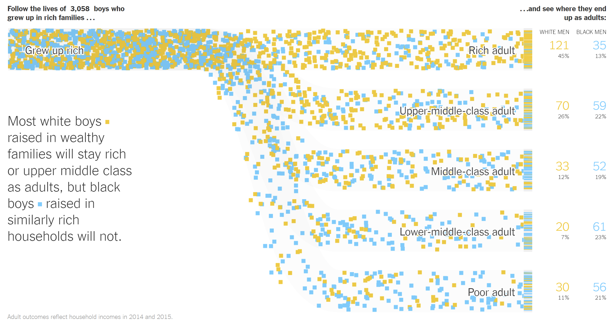
```

The interactive chart featured in the New York Times article (Figure \@ref(fig:nyt)) unveils the issue of income disparities between black and white children who were raised in families with comparable income according to @race. This visualization reveals that, compared to white children, black children are more likely to drop down to the lower-income group, given that they both grew up in wealthy families.

  In the visualization, each observation is initially classified into one group at the start and potentially transitions into either the same group or a different group. This dynamic visualization constructs questions on the broader use of this visualization to other types of data. The potential use of this visualization on accounting data is to convey a message, as reported by @oecd_report, that the concept of zombie companies is not unique to Japan alone. It is also present in the United States, which has a faster metabolization rate (more new listings and exits) relative to Japan.
  
  The political data that exhibits the movement of voters switching party affiliations between elections can be a valuable insight into the behavior of the voters. This data could be extended to incorporate demographic information about the voters, providing analysts with significant insight into voter behavior and allowing them to consolidate effective campaigns for their political party. It can also be applied to marketing data, where customers shift their product interest to the competitor, providing the marketing analysts with an understanding of both the company's products and the overall market.

  This animation was developed using software based on JavaScript, D3.js (@d3js), and WebGL (@webgl). The D3 JavaScript is one of the most widely known libraries for creating an interactive and dynamic visualization. It enables the designers to bind both the data and graphical elements to the DOM (Document Object Model). On the other hand, WebGL functions as a JavaScript API for rendering interactive 2D and 3D graphics within any compatible web browser without the use of plug-ins. 
  
  @Hvitfeldt_2018 provides R (@r) code to generate an animation similar to that of the New York Times. Taking inspiration from this example, \CRANpkg{animbook} expands upon the visualization in numerous ways and packages the code so that it can be used for a variety of similar animations for studying flow and temporal change data.
  
  The New York Times visualization is similar to a Sankey plot. Sankey plots are flow diagrams that show the movement/change from one category level to another, with the width of each arrow representing the proportional changes between levels. There are several R packages available to generate versions of Sankey plots, including \CRANpkg{ggalluvial} and \CRANpkg{ggparallel}. The main difference between the Sankey plot visualization and the animation featured in the New York Times lies in their methods of representing the proportion of changes. Sankey plots utilize the width of connecting lines, while the New York Times animation employs the density and color of points. 

  
# Data {#data}

```{r data-diagram, fig.cap="The animation expects data with an ID and a time variable, along with a numerical variable (raw form), which is possibly converted to categorical (categorized). The data can be provided in the raw or categorized form and will be processed into the format needed for the animation, where the categorical variable is treated as a quantile and an animation frame variable is created.", fig.width=8, fig.align='center', out.width="100%", layout = "l-body"}
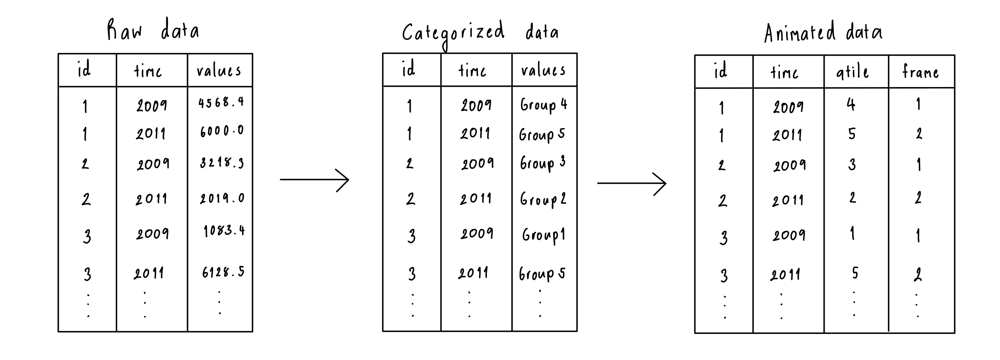
```

In the data structure, there are requirements that must be followed for reproducing the animation. First, the data set needs to be in a `tidy data` format (@tidy-data). The data then must have at least ID and time variables, in addition to the measured variables, which would usually be numeric but can also be categorical as well. The ID variable indicates the individual, which is followed over time, such as the company name. There may also be a grouping variable, such as the country where the company is registered.

  Figure \@ref(fig:data-diagram) illustrates the expected format of the data and variables created to prepare it for the animation. We start with the raw data structure. The values are presented in the numerical format, which we call the 'raw' form. In most cases, the measured variable will be numerical and require transformation. The second form is categorized data, which involves transforming numerical variables into categories, typically quantiles. This transformation may not be necessary if it is already provided in the categorized format. The last form is animated data, where the frame is assigned to each unique ID.
  
  One of the frequently encountered values in the dataset is NA, commonly known as a missing value. In the context of accounting data, NA might signify that a company is either not yet listed or has been de-listed. In scenarios like voter data, NA may indicate that individuals did not provide the necessary information. Disregarding NA values could result in the loss of valuable information. Therefore, instead of completely removing NA entries, this information is categorized into its quantiles, ensuring that the missing data are factored into the visualization.


# Animation tools {#animation}

```{r animation-diagram, fig.cap="An animation requires small changes shown in quick succession to make it appear as if the objects are in motion. The three plots above show a single point changing position by a small amount, which when shown quickly, will look like that point has moved up and to the right.", fig.width=8, fig.align='center', out.width="100%", layout = "l-body"}
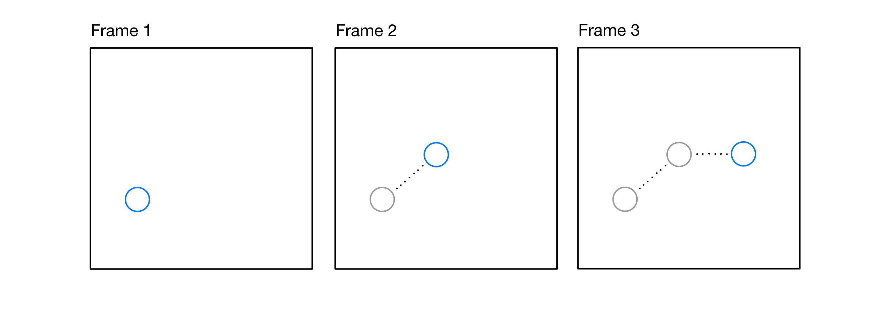
```

A principle important for designing a useful animation is called persistence of vision (@animation-mechanic). When an image disappears, the brain will retain the previous images for a brief period of time. It is this slight period of retention that allows humans to separate sequential images. If this is seen in quick succession, it will appear as if the objects are in motion. This is illustrated in Figure \@ref(fig:animation-diagram).

  There are multiple ways to create an animation in the R environment (@r), including the packages \CRANpkg{gganimate} (@gganimate) and \CRANpkg{plotly} (@plotly).
  
  The \CRANpkg{gganimate} package is an extension from the \CRANpkg{ggplot2} package (@ggplot2) to include the description of an animation. It added new grammar classes to the plot object, allowing it to understand how the plot should change over time. The use of `transition_*()` functions allows it to achieve this by specifying how the data evolves and how it relates to itself across time. The \CRANpkg{gganimate} includes `gifski_renderer()` from the \CRANpkg{gifski} package (@gifski) to save animation in GIF format or `av_renderer()` from the \CRANpkg{av} package (@av) to save it into a video file format.
  
  The `plotly` software is a graphic library that provides tools for creating an interactive plot in multiple programming languages, such as R, JavaScript, Python, and Julia. In R, plotly can be accessed through the \CRANpkg{plotly} package, which integrates plotly.js from the JavaScript graphing library. The usage of this library can be from a converting function, `ggplotly()`, or a standalone function, `plot_ly()`. The conversion is accomplished by taking the elements from the `ggplot` object and then redrawing them using the plotly.js.
  
```{r animated-diagram, fig.cap="Frames 1 and 2 show the year 1 and year 2 positions of points from the data in the table at the top. The id is necessary to enable interpolation to make the small changes to generate a perception of motion from frame 1 position to frame 2 position.", fig.width=8, fig.align='center', out.width="100%", layout = "l-body"}
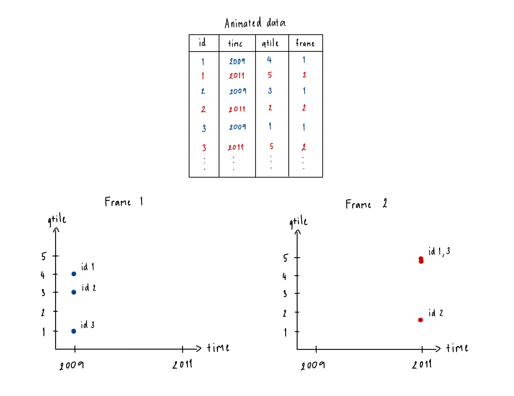
```

  In the context of data, as shown in Figure \@ref(fig:animated-diagram), observations are positioned at specific points in time. The further the distance between these points, the less smooth the animation becomes. This issue can be eliminated by interpolating additional points in between the observations. In the \CRANpkg{gganimate} package, the interpolation is achieved using the \CRANpkg{tweenr} package (@tweenr), while in \CRANpkg{plotly}, it utilizes d3.interpolate (@d3js).
  
  Figure \@ref(fig:animated-diagram) demonstrates how the frame variables are applied in an animated plot. The frame variable within the animated data structure allows the animation function to determine the position of observations on the plot at any given frame.
  
  From @learner-control, it suggests that having control options for the animation can improve the efficiency of the learning process. Additionally, the length and speed of the animation should also be taken into consideration. According to @mayer-2010, the working memory, responsible for selecting and processing information from sensory memory, only holds a processed version of what was presented for generally less than thirty seconds.
  
  In \CRANpkg{gganimate}, the issue of integrating controls can be addressed by setting the `renderer` argument to be `av_renderer()`, which allows the animation output to be in media applications provided in their systems. As for adjusting the length and speed of the animation, the `nframes` and `fps` arguments can be utilized. The `nframes` dictate the number of frames to be rendered, while `fps` controls how many frames are displayed in one second. Using these two parameters, the duration of the animation in seconds can be calculated as follows: length = nframes/fps.
  
  In the case of \CRANpkg{plotly}, control integration is already implemented by default. The `frame` and `transition` arguments within the `animation_opts()` function can be specified to set the length and speed of the animation.
  

# Visualization design {#design}

The animated visualization can be an effective communication tool (@Mayer_Moreno_2002; @effective-trend). It helps with communicating changing data values, enhancing the narrative, and keeping it engaging for the audience. According to @Mayer_Moreno_2002, animation can improve learning, especially when the goal is to promote deep understanding.

  @mayer_2005 states that designing multimedia requires the designer to understand how people learn. One of the principles in @mayer_2005, Redundancy, suggests that a piece of excess information could overload the learners. By this principle, the animation must be carefully designed to avoid this pitfall.
  
```{r proportional-shade, fig.show="hold", out.width="50%", fig.cap="The plot shows the difference between the sigmoid (left) and the sine curve (right). In the sigmoid, as the curve progresses, it appears to become narrower, possibly resulting in more misperception of relative proportions compared to the sine curve."}
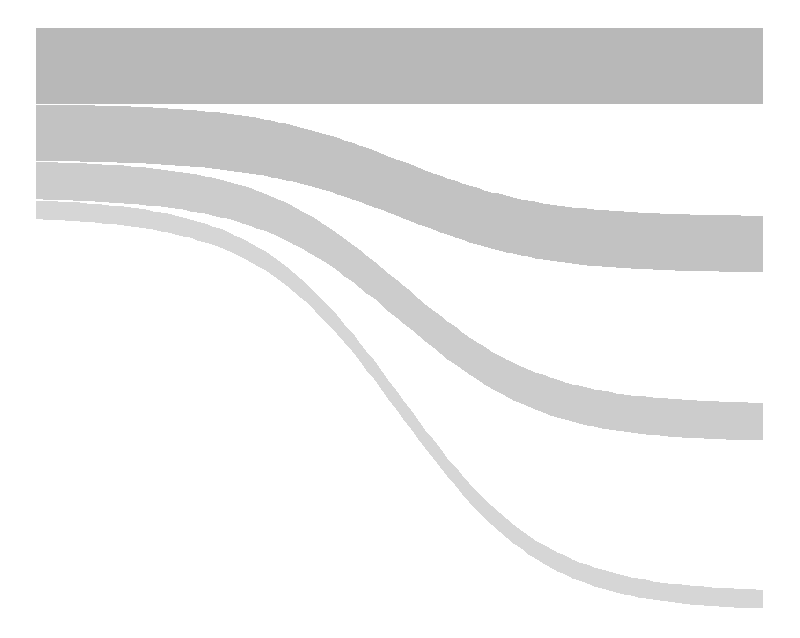
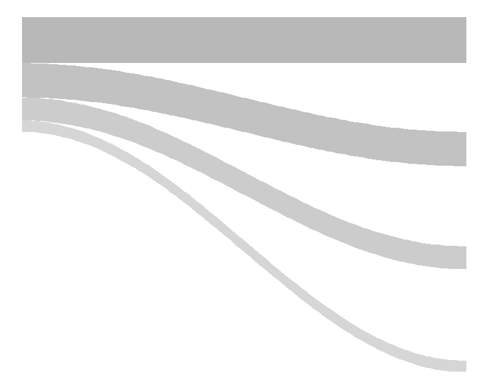
```

  The incorporation of proportional shaded areas in this animation package serves to enhance the comprehension of proportion information, effectively displaying the distribution within each group. To represent sub-groups, points are colored to focus attention on differences between groups of observation.

  Discerning the movement pattern or proportion of sub-groups can be challenging when there are only a small number of points. To address this, the sample size is inflated by calculating the sub-group proportion and multiplying it by the desired total number of points. This approach ensures a richer representation of movement patterns.
  
  Another issue is that all observations would have a common starting time. It would mean all points start the animation simultaneously and move as a block through time. It poses a challenge in distinguishing and tracking individual observations and their change patterns. To alleviate this, the observations in the animation are randomly started at different times so a continuous flow of points can be seen. It is important to note that this does not necessarily reflect the real-time occurrence of observations.
  
  The paths of observations are also interpolated to create small changes in the position of points to produce the appearance of motion. The interpolation functions in \CRANpkg{gganimate} and \CRANpkg{plotly} are inadequate because they only generate a linear path. Our animation needs a non-linear path to show the flow. Sigmoid curves are commonly used in Sankey diagrams (@Hvitfeldt_2018). However, @Shaffer_2019 argues that a sine curve more accurately represents proportion throughout the path. As illustrated in Figure \@ref(fig:proportional-shade). The sigmoid accurately represents the proportion at the beginning and end, but as it curves, the shape gets narrower, leading to a less accurate proportion representation than the sine curve. New interpolation functions are needed to compute both the sigmoid and sine paths.

# Software {#software}

## Installation

\CRANpkg{animbook} is available through CRAN. The development version of this package can be found in the Github repositories.

``` r
# CRAN
install.packages("animbook")

# Development version
devtools::install_github("KrisanatA/animbook")
```


## Overview of functions

In designing the \CRANpkg{animbook} package, a three-step structured approach was developed to create an animation. The initial step is to reformat the data into a categorized data structure, as seen in Figure \@ref(fig:data-diagram). The second stage is creating a `ggplot` object, which can be subsequently passed into the animation function. During the second stage, an internal function will turn the categorized data into an animated data structure. The final step involves transforming the `ggplot` to a `gganimate` object by integrating the animation settings. This three-step structure was implemented to ensure that users, regardless of their level of experience, can produce the animations with simplicity while retaining customization for more experienced users.


### Data pre-processing

From Figure \@ref(fig:data-diagram), there is a need to map numerical value to a category. One way to handle this is by ranking the sales and grouping the rankings into quantiles. In some cases, this may not be the best option. When the observation is moved up by quantile, one is bound to move down, making the amount of observation in the quantile remain the same. This issue can be resolved by using an alternative method, which is grouping values based on their absolute values. Users may also be interested in grouping the data based on different groups, for example, ranking within a specific country. This generalization leads to four different scaling methods for the numerical data.

  1. Ranking by year. (rank)
  2. Ranking by year within a group. (rank_group)
  3. Fix bins relative to absolute values by year. (absolute)
  4. Fix bins relative to absolute values by year within a group. (absolute_group)

```{r}
original <- dbl_change |> 
  filter(id %in% c(1, 14, 21, 100, 106, 148)) |> 
  reframe(id, time, values, gp) |> 
  arrange(gp, id)

rank <- anim_prep(dbl_change, id, values, time, 
                  group = gp) 

class(rank) <- c("tbl_df", "tbl", "data.frame")

rank_data <- rank |> 
  filter(id %in% c(1, 14, 21, 100, 106, 148)) |> 
  rename(gp = group,
         rank = qtile) |>  
  arrange(gp, id)

absolute <- anim_prep(dbl_change, id, values, time, 
                      group = gp, 
                      scaling = "absolute") 

class(absolute) <- c("tbl_df", "tbl", "data.frame")

absolute_data <- absolute |> 
  filter(id %in% c(1, 14, 21, 100, 106, 148)) |>  
  rename(gp = group,
         absolute = qtile) |> 
  arrange(gp, id)

rank_group <- anim_prep(dbl_change, id, values, time, 
                        group = gp, 
                        group_scaling = gp) 

class(rank_group) <- c("tbl_df", "tbl", "data.frame")

rank_group_data <- rank_group |> 
  filter(id %in% c(1, 14, 21, 100, 106, 148)) |> 
  rename(gp = group,
         rank_group = qtile) |> 
  arrange(gp, id)

absolute_group <- anim_prep(dbl_change, id, values, time, 
                            group = gp, 
                            group_scaling = gp, 
                            scaling = "absolute") 

class(absolute_group) <- c("tbl_df", "tbl", "data.frame")

absolute_group_data <- absolute_group |> 
  filter(id %in% c(1, 14, 21, 100, 106, 148)) |> 
  rename(gp = group,
         absolute_group = qtile) |> 
  arrange(gp, id)
```

```{r}
original |> 
  left_join(rank_data, by = c("id", "time", "gp")) |> 
  left_join(rank_group_data, by = c("id", "time", "gp")) |> 
  left_join(absolute_data, by = c("id", "time", "gp")) |> 
  left_join(absolute_group_data, by = c("id", "time", "gp")) |> 
  reframe(id, time, gp, values, rank, rank_group, absolute, absolute_group)
```
  
  For the first and second scaling methods, it is necessary to rank the values based on time, and in cases where a group is provided, they are ranked based on both time and groups. To ensure that the rank scales among different groups are the same, the variables are first normalized to a range between 0 and 1. The third and fourth scaling methods also involve a normalization step, but they are based on raw values instead of rank values.
  
  All of these scaling methods utilized the `cut()` function from the base R package (@r) to split the values into quantiles. The `cut()` function requires the specification of the `breaks` argument. If it is not provided, the prep function in this package defaults to using the `seq()` function, which sets the minimum and maximum values to 0 and 1, respectively, and then increments by equal steps based on the number of groups of interest. Additionally, the users have the option to specify the breaks themselves if they choose to do so, noting that the breaks provided need to be between 0 and 1, and the length of the vector needs to be the number of groups plus 1. 
  
  All of the pre-processing steps mentioned above are completed using the `anim_prep()` or `anim_prep_cat()` function, depending on the stages of the data structure. The `anim_prep()` function is used for raw data format, while the `anim_prep_cat()` function is for categorized data format. There are additional arguments that allow users for more customization.

  These are only the initial steps in formatting the data into a category. Now that there is a method to transform the data from the raw into a categorized format, the next step is to modify it into an animated data structure. It is carried out by assigning a frame to each individual observation, ensuring that each ID does not contain repeated frame values. It lets the \CRANpkg{gganimate} or \CRANpkg{plotly} perceive where the observation would be on the plot at a given frame, as seen in Figure \@ref(fig:animated-diagram).
  
  The frame variable is assigned by sorting the data based on the ID and time using the `arrange()` function, followed by applying the `group_by()` function on the ID, allowing the `row_number()` function to be performed within each group. The functions mentioned in this paragraph are from the \CRANpkg{dplyr} package (@dplyr). These are done by the internal function for each of the plots provided in the packages.
  
```{r}
argument_num <- c("data", "id", "values", "time", "group", "ncat", "breaks", "label", 
              "group_scaling", "scaling")

description_num <- c("The numerical data to be prepared for visualization.",
                     "The column name in the data that will be used to identify an individual over time. For example, company name.",
                     "The column name in the data that will be used for the y-axis (must be numerical).",
                     "The column name in the data represents the time variable (x-axis).",
                     "The column name in the data for distinguishes between the values group (for example, country). In the visualization, this will be used as a color argument.",
                     "The number of categories to create for scaling values. The default for this function is 5 categories.",
                     "A vector of breaks for creating bins. If this is not provided, the bins will have equal size.",
                     "A vector of labels to be used for the y-axis in the visualization. If this is not provided, the labels will be the position on the y-axis.",
                     "The column name in the data that will be used for grouping. Allow the function to isolate the calculation between the groups.",
                     "The scaling method to be used; \"rank\" or \"absolute\". The default scaling is \"rank\".") 

argument_num_tab <- tibble::tibble(Argument = argument_num,
                                   Description = description_num)
```

```{r}
argument_cat <- c("data", "id", "values", "time", "group", "order", "label")

description_cat <- c("The data that contains the values in the categorized format.",
                     "The column name in the data that will be used to identify an individual over time. For example, election parties.",
                     "The column name in the data that will be used for the y-axis (must be a factor).",
                     "The column name in the data represents the time variable (x-axis).",
                     "The column name in the data for distinguishes between the values group (for example, gender). In the visualization, this will be used as a color argument.",
                     "A vector of order for sorting the category values. If this is not provided, it will be arranged based on the number of observations (largest to smallest).",
                     "A vector of labels to be used for the y-axis in the visualization. If this is not provided, the labels will be the position on the y-axis.")

argument_cat_tab <- tibble::tibble(Argument = argument_cat,
                                   Description = description_cat)
```

```{r tbl-num, eval=knitr::is_html_output()}
argument_num_tab |> 
  knitr::kable(caption = "The arguments for the anim\\_prep function.")
```

```{r tbl-num-la, eval=knitr::is_latex_output()}
argument_num_tab |> 
  kableExtra::kable(caption = "The arguments for the anim\\_prep function.", format = "latex") |> 
  kableExtra::column_spec(2, width = "30em")
```

```{r tbl-cat, eval=knitr::is_html_output()}
argument_cat_tab |> 
  knitr::kable(caption = "The arguments for the anim\\_prep\\_cat function.")
```

```{r tbl-cat-la, eval=knitr::is_latex_output()}
argument_num_tab |> 
  kableExtra::kable(caption = "The argumenst for the anim\\_prep\\_cat function.", format = "latex") |> 
  kableExtra::column_spec(2, width = "30em")
```
  
  The arguments for the `anim_prep()` and `anim_prep_cat()` functions are listed in Tables `r knitr::asis_output(ifelse(knitr::is_latex_output(), '\\ref{tab:tbl-num-la}','\\@ref(tab:tbl-num)'))` and `r knitr::asis_output(ifelse(knitr::is_latex_output(), '\\ref{tab:tbl-cat-la}','\\@ref(tab:tbl-cat)'))` respectively. The `data`, `id`, `values`, and `time` arguments are required for both functions.
  
  The `ncat`, `breaks`, `group_scaling`, and `scaling` arguments are for the user to customize the data scaling calculation in the `anim_prep()` function. In the `anim_prep_cat` function, the users can customize the order of the category to be shown on the y-axis using the `order` argument.
  
  Then, for further customization regarding how the final visualization looks. The `group`, `label`, and `time_dependent` arguments can be adjusted. 
  
  The `time_dependent` argument provides the user flexibility to choose whether points will start simultaneously (`time_dependent = TRUE`) or randomly (`time_dependent = FALSE`). The challenge with points starting at the same time is the formation of point clusters, making it difficult to track individual points. Allowing for the random starting time makes point tracking simpler. The starting times for the points are generated using the `runif()` function, where the `max` argument can be adjusted using the `width` parameter in the plotting function.
  

### Plotting function

Once the data is prepared. The next step is to create the `ggplot` object as a basis for the animation. There are three plots available in this package. Two of the plots could be used for the animation, and another plot is used as a static visualization. All of each plot has an associated internal function that converts the categorized data format into the animated structure.

  - `kangaroo_plot()`: plots the observation's movement over time.
  - `wallaby_plot()`: the subset plot of the `kangaroo_plot` with the time limit to only start and end.
  - `funnel_web_plot()`: the faceted static plot by time variable.
  
  The names of these plots draw inspiration from native Australian animals. The comprehensive plot is named Kangaroo, while its subset is referred to as Wallaby, representing a smaller version of the Kangaroo. The final plot is named after the Funnel Web Spider, drawing inspiration from the plot's features and the distinctive legs of the spider.

  The main focus of this paper will be on the `wallaby_plot()`, which draws inspiration from the New York Times animation and combines the knowledge gained from the previous sections in creating the visualization.

  The `wallaby_data()` function is responsible for performing data manipulation and formatting tasks on the original object. It includes creating additional data components for labeling and shading. This function is also responsible for interpolating the non-linear path. It performs this task by mapping the `sine()` function provided in this package to each observation using the `map()` function from the \CRANpkg{purrr} package (@purrr). The frame is recalculated using the same method mentioned in the data preprocessing section. The `proportional_shade()` function is called to generate the proportional shaded data.
  
  The `proportional_shade()` function's algorithm begins by calculating the corner points for each shaded area. Subsequently, the algorithm utilizes the `sine()` function to interpolate points between the left and right boundaries. Once this interpolation is completed, all the generated points are interconnected to form the shaded regions.
  
  Now that the data are in the right format for the wallaby's plot, the `geom_point()` function is used for plotting the observations, `geom_polygon()` is used for creating the proportional shaded areas, and `geom_text()` is used for creating labels. These three functions are from the \CRANpkg{ggplot2} package. During this process, the aesthetics mapping will be different depending on the rendering tool to be used, which can be either `gganimate` or `plotly`. The difference between the two rendering tools is that for `plotly`, the `ids` and `frame` arguments need to be specified during the creation of the `ggplot` object.
  
```{r}
argument2 <- c("data", "group_palette", "shade_palette", "rendering", "time_dependent",
               "subset", "relation", "total_point", "height", "width", "size",
               "alpha")

description2 <- c("The categorized data returned from the prep function.",
                  "The vector of the palette used by the function to supply the color to each group.",
                  "The vector of the palette used by the function to supply the color to the shaded area.",
                  "The choice of method used to create and display the plot, either gganimate or plotly. Default is gganimate.",
                  "Should the observations entered the visualization at the same time. Default is FALSE",
                  "A character string specifying the variable used for subsetting the data. The \"top\" and \"bottom\" strings can also be used in this argument. Default is \"top\".",
                  "The choice of relationship for the values to display on the plot, either \"one_many.\" or \"many_one\". Default is \"one_many\".",
                  "The number of points the users want for the wallaby plot. Default is NULL, which is the number of points equal to the original.",
                  "The proportion of the area occupied by the observations in the shaded areas. Default is 0.6.",
                  "The distance between the first and last observation in the animation. Default is 50.",
                  "The point size. Default is 2.",
                  "The opacity of the proportional shaded areas. Default is 0.1.")

argument_table2 <- tibble::tibble(Argument = argument2,
                                  Description = description2)
```

```{r, eval=knitr::is_html_output()}
argument_table2 |> 
  knitr::kable(caption = "The arguments for the wallaby\\_plot function.")
```

```{r, eval=knitr::is_latex_output()}
argument_table2 |> 
  kableExtra::kable(caption = "The arguments for the wallaby\\_plot function.", format = "latex") |> 
  kableExtra::column_spec(2, width = "30em")
```


### Animating function

It is necessary to store the plot as a `ggplot` object before passing it to the final function, `anim_animate()`, to animate. This function will automatically detect which rendering method was specified in the previous steps and add the minimum requirement functions accordingly. By default, if the user specifies the rendering as `gganimate`, then it will add the `transition_time()` function from the \CRANpkg{gganimate} package. Otherwise, the `animation_opts()` function will be added from the \CRANpkg{plotly} package.


## Example usage

The `cat_change` data in the package is used to illustrate how to use this package. It has five categories, A to E, over two time points. Since the data is already in the categorized data structure, the `anim_prep_cat()` function is used. The output from this function is a class called `categorized`.

```{r, echo=TRUE}
a <- anim_prep_cat(cat_change, 
                   id = id, 
                   values = qnt, 
                   time = time, 
                   group = gp)
class(a)
glimpse(a)
```

To obtain an object for the animation function, the `wallaby_plot` function is used. The `subset` and `relation` arguments are applied to refine the final appearance of the animation, Figure \@ref(fig:top-one).

```{r top-one, echo=TRUE, fig.width=8, fig.align='center', out.width="100%", layout = "l-body", fig.cap="This illustrates the transition of points from the left category A to the right categories A and E. This is also referred to as a one-to-many relationship plot. The points shown in this plot only originated in category A. It emphasizes that these points only stay within the same category A or change to category E."}
p <- wallaby_plot(data = a,
                  group_palette = RColorBrewer::brewer.pal(9, "Set1"),
                  rendering = "gganimate",
                  subset = "top",
                  relation = "one_many",
                  total_point = NULL)

p
```

Figure \@ref(fig:top-many), shows the flexibility to use various options, such as `subset` or `relation`, to customize the plot appearance. Here `subset = "top"` is used to specify category A for the final time point, and `relation = "many_one"` is used to specify that all categories flowing into A at time point 2 are shown.

```{r top-many, echo=TRUE, fig.width=8, fig.align='center', out.width="100%", layout = "l-body", fig.cap="The plot shows the movement of points from categories A and E on the right to category A on the left, representing a many-to-one relationship. This specifically highlights the points that have moved to category A, which are the points that originate from categories A and E."}
p_2 <- wallaby_plot(data = a,
                    rendering = "gganimate",
                    subset = "top",
                    relation = "many_one",
                    total_point = NULL)

p_2
```

Using `subset = "B"` will only show the point for a single category as shown in Figure \@ref(fig:b-many).

```{r b-many, echo=TRUE, fig.width=8, fig.align='center', out.width="100%", layout = "l-body", fig.cap="The plot shows the transfer of points from the right category B to the left category B. It underscores that the points ultimately landing in category B originate specifically from category B itself."}
p_3 <- wallaby_plot(data = a,
                    rendering = "gganimate",
                    subset = "B",
                    relation = "many_one",
                    total_point = NULL)

p_3
```

This plot object is passed to the `anim_animate()` function to transform it into a `gganimate` object, which appears as an animation when the `animate()` function from \CRANpkg{gganimate} is used for rendering. This can be seen in Figure `r knitr::asis_output(ifelse(knitr::is_latex_output(), '\\ref{fig:catchange-figure}','\\@ref(fig:catchange-gif)'))`

```{r, eval=FALSE}
p2 <- anim_animate(p)

gganimate::anim_save("figures/catchange.gif", p2, height = 8, fps = 30,
                     nframes = 400, width = 9, units = "in", res = 150)
```

``` r
p2 <- anim_animate(p)

gganimate::animate(p2)
```

```{r catchange-figure, fig.cap = "Four single frames from the animated visualization using example data. All of the X observations stay within the same group, while Y observations change from group A to group E.", fig.width=8, fig.align='center', out.width="100%", layout = "l-page", eval=knitr::is_latex_output()}
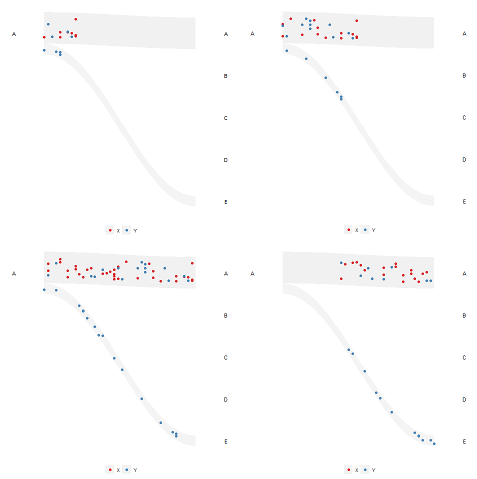
```

```{r catchange-gif, out.extra="class = 'gif'", fig.cap = "Animated visualization using example data. All of the X observations stay within the same group, while some of the Y observations change from group A to group E.", eval=knitr::is_html_output()}
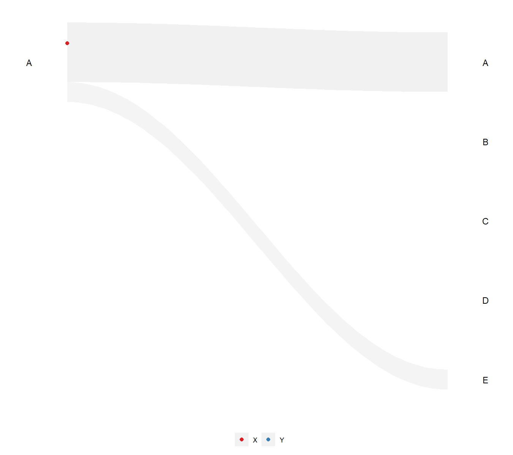
```


# Applications

Two real-world examples of usage are provided. The osiris example studies company movement between quartiles of sales performance over a 12-year period. The voting example studies party preference changes between the 2016 and 2019 elections.


## Accounting database: osiris

The Osiris data presented in this section was acquired from Bureau van Dijk (@bvd), compiling information on a total of 122,318 companies. It was subsequently subsetted for the 2021 report, consisting of 1000 companies with 94 variables. The dataset included in the package focuses on 790 companies, spanning from 2006 to 2018. The variables in this dataset include year, ID, country, sales, and japan.

  @oecd_report reported that companies in the United States have a faster metabolic rate relative to Japanese companies. This means that US companies tend to move up and down in the performance metrics more frequently than Japanese companies. This can be examined using the wallaby and kangaroo plots. The wallaby plot allows the study of entry and exit behavior. The kangaroo plot allows for studying the full movement of companies over time.
  
  The steps needed to create both plots are:
  
1. Filter the countries to include only the United States and Japan. 
2. Prepare the data using the `anim_prep` function with the first scaling, which is a ranking method. The variable `sales` is used as the performance metric. Four quantiles (quartiles) are used as specified by `ncat = 4`, and NAs are converted into a fifth category labeled as "Not listed".
3. Use the `wallaby_plot` and `kangaroo_plot` functions to create `ggplot` objects and add default settings for `gganimate` rendering. In the wallaby plot, the `subset` and `relation` options are set to "bottom" and "many_one", respectively, to focus on exiting behavior. 
  
```{r, echo=TRUE}
# library(animbook)
# library(dplyr)

data <- osiris |> 
  filter(country %in% c("US", "JP"))

label <- c("Top 25%", "25-50", "50-75", "75-100", "Not listed")

accounting <- anim_prep(data, 
                      id = ID, 
                      values = sales, 
                      time = year, 
                      label = label, 
                      ncat = 4, 
                      group = country)

kan_p <- kangaroo_plot(accounting)

p <- wallaby_plot(accounting,
                  subset = "bottom",
                  relation = "many_one",
                  height = 1,
                  size = 2,
                  width = 100,
                  total_point = 1000)

kan_p2 <- anim_animate(kan_p)

p2 <- anim_animate(p)
```
  
```{r, eval=FALSE}
gganimate::anim_save("figures/exit.gif", p2, height = 8, fps = 30,
                     nframes = 400, width = 9, units = "in", res = 150)

gganimate::anim_save("figures/kan-osiris.gif", kan_p2, height = 8, fps = 10,
                     nframes = 400, width = 9, units = "in", res = 150)
```

``` r
gganimate::animate(kan_p2)

gganimate::animate(p2)
```

```{r kan-osiris-figure, fig.cap = "Four frames from the kangaroo plot visualization showing the movement of the Japanese and US companies between the performance sales quantiles from 2006 to 2018 for a sample of data extracted from the Osiris database. The 'not listed' category indicates companies not yet listed or removed from the listing. Most companies stay in the same quantile group, with a small number moving up and down. Most of the movement is made by American companies, which supports the OECD report that US companies have a higher turnover rate relative to Japanese companies.", fig.width=8, fig.align='center', out.width="100%", layout = "l-page", eval=knitr::is_latex_output()}
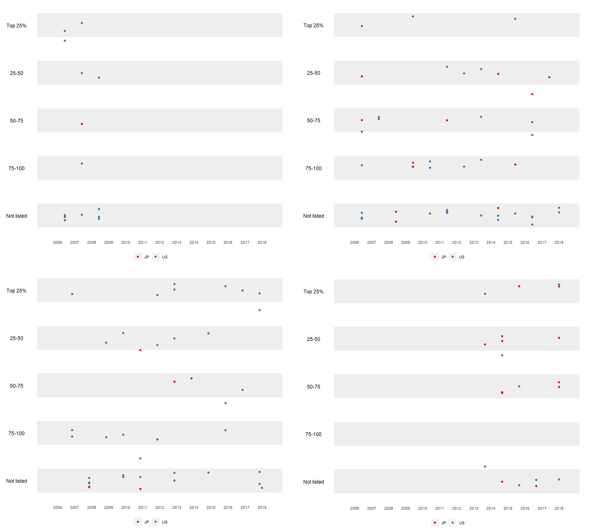
```

```{r kan-osiris-gif, out.extra="class = 'gif'", fig.cap = "The kangaroo plot visualization shows the movement of the Japanese and US companies between the performance sales quantiles from 2006 to 2018 for a sample of data extracted from the Osiris database. The 'not listed' category indicates companies not yet listed or removed from the listing. Most companies stay in the same quantile group, with a small number moving up and down. Most of the movement is made by American companies, which supports the OECD report that US companies have a higher turnover rate relative to Japanese companies.", eval=knitr::is_html_output()}
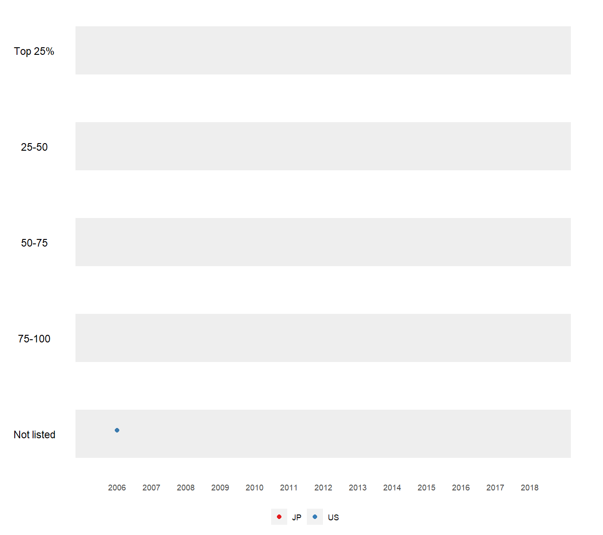
```

In the kangaroo plot (Figure `r knitr::asis_output(ifelse(knitr::is_latex_output(), '\\ref{fig:kan-osiris-figure}','\\@ref(fig:kan-osiris-gif)'))`) the five gray bars indicate the five categories (Top 25%, 25-50, 50-75, 75-100, Not listed) across years 2006 and 2018. Points represent individual companies with color indicating the country of registration. Points that stay within the bar indicate companies that remain in the same quartile over the entire time period. If a company drops in performance or improves performance to the extent of switching quartile, the corresponding point will jump up or down in this plot. Note that all the companies in the "Not listed" category were listed at some point during this time period. It can be seen that most companies stay in the same quantile group over the time period. There are several companies that move up and down, and most of these are US companies. This supports the @oecd_report claim that US companies have a higher turnover rate compared to Japanese companies.

Perceiving the differences between the movement patterns of groups can be difficult, especially when the groups have different sizes, as is the case here. There are more US companies than Japanese companies, and particularly, there are more US companies in the top 25 percent quantile. Thus, there will likely be more blue points (US) moving than red points (JP) purely for this reason. The difference that is of interest is **relative proportion**, that one country has a higher fraction of companies moving between quartiles than the other. This animated Sankey plot requires the reader to mentally calculate the fraction of points that are moving, separately for the blue and red points, to answer the question of whether one group has a higher movement rate. The task is easier if the two groups have a similar number of points. 

```{r osiris-figure, fig.cap = "The wallaby plot visualization shows the companies that exited the market. There are more United States companies that fall down into a not listed group (got de-listed) compared to Japanese companies.", fig.width=8, fig.align='center', out.width="100%", layout = "l-page", eval=knitr::is_latex_output()}
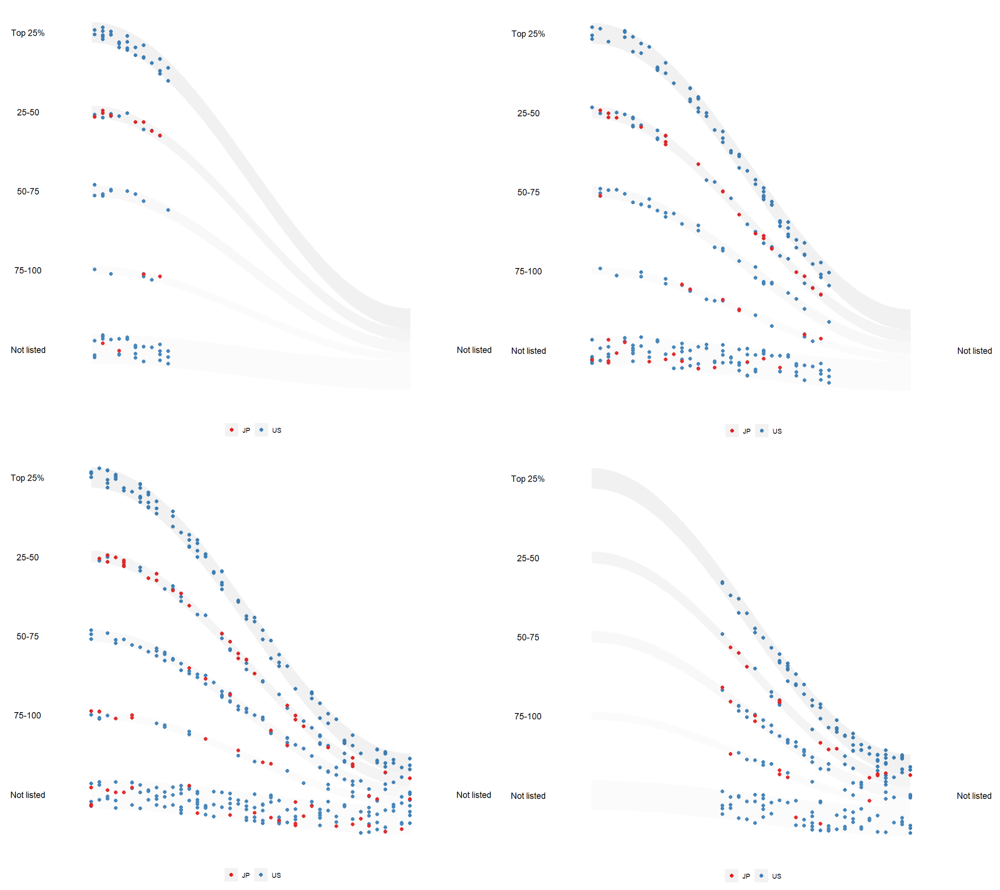
```

```{r osiris-gif, out.extra="class = 'gif'", fig.cap = "The wallaby plot visualization shows the companies that exited the market. There are more United States companies that fall down into a not listed group (got de-listed) compared to Japanese companies.", eval=knitr::is_html_output()}
knitr::include_graphics("figures/exit.gif")
```

  In Figure `r knitr::asis_output(ifelse(knitr::is_latex_output(), '\\ref{fig:osiris-figure}','\\@ref(fig:osiris-gif)'))`, the focus is placed on companies that exited the market in 2018 that were in the market at some point since 2006. The gray regions show the proportion of companies in each of the categories in 2006 on the left that exited the market by 2018. (explain the difference in proportion and not listed companies). In 2006, the companies represented by points, colored by country, were in one of the quartiles or "Not listed" category. All the companies in the Top 25% were US companies. Any Japanese companies in the Top 25% in 2006 did not exit the market (Not listed). It is worth noting that there are actually none of the Japanese companies in the Top 25% in 2006. It is also interesting that the larger proportion of the companies in the Top 25% are getting de-listed, and the lower the quartiles, the less likely that the companies will exit the market.
  
  The wallaby plot can be employed to emphasize the high turnover rate observed in the kangaroo plot, as it specifically focuses on a subset, allowing the users to better perceive the **relative proportion**. However, it is also important to note that this plot is confined to only two-time points (start and end), which may not provide a comprehensive view of the entire story.


## Voter behavior

The election survey dataset included in the \CRANpkg{animbook} package focuses on the voter behavior of the 734 individuals who participated in the 2019 survey. The variables in this data are id, year, party, and gender. The ID variable has been de-identified to ensure the privacy of the responders, preventing the identification of the survey participants. The year column is derived from the two different questions in the survey, which answered how the top party performs in keeping the old voters of different genders relative to the 2016 Australian election results. This dataset was collected from ADA Dataverse (@aeles).

```{r}
aeles <- aeles |> 
  filter(party != "other")
```

```{r, echo=TRUE}
voter <- anim_prep_cat(data = aeles,
                       id = id,
                       values = party,
                       time = year,
                       group = gender,
                       order = NULL)

p_voter <- wallaby_plot(data = voter,
                  group_palette = c("pink", "blue", "red"),
                  shade_palette = c("#737373", "#969696", "#BDBDBD",
                                    "#D9D9D9","#D9D9D9","#D9D9D9"),
                  rendering = "gganimate",
                  subset = "top",
                  relation = "one_many",
                  height = 1,
                  size = 2.5,
                  width = 100,
                  total_point = 1000)

p2_voter <- anim_animate(p_voter)
```

```{r, eval=FALSE}
gganimate::anim_save("figures/voter.gif", p2_voter, height = 8, fps = 30,
                     nframes = 400, width = 9, units = "in", res = 150)
```

``` r
gganimate::animate(p2_voter)
```

```{r voter-figure, fig.cap = "Four frames from a wallaby plot visualization show how the top party performs in keeping the old voters of different genders. Most voters remain loyal to the party, but a small fraction of voters with roughly equal male-to-female ratio switch primarily to the other major party. Interestingly, the few individuals who identified as neither male nor female overwhelmingly shifted their party affiliations to the Greens.", fig.width=8, fig.align='center', out.width="100%", layout = "l-page", eval=knitr::is_latex_output()}
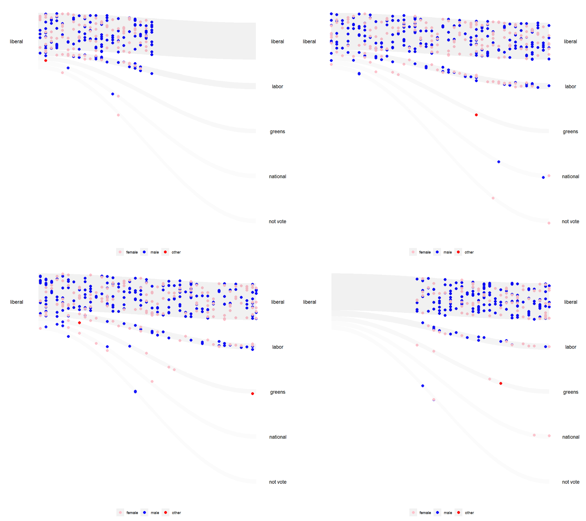
```

```{r voter-gif, out.extra="class = 'gif'", fig.cap = "The wallaby plot visualization shows how the top party performs in keeping the old voters of different genders. Most voters remain loyal to the party, but a small fraction of voters with roughly equal male-to-female ratio switch primarily to the other major party. Interestingly, the few individuals who identified as neither male nor female overwhelmingly shifted their party affiliations to the Greens.", eval=knitr::is_html_output()}
knitr::include_graphics("figures/voter.gif")
```

  From Figure `r knitr::asis_output(ifelse(knitr::is_latex_output(), '\\ref{fig:voter-figure}','\\@ref(fig:voter-gif)'))`, it reveals an intriguing pattern where individuals who identified their gender as 'others' have shifted their voting preference from the Liberal Party, the leading party in 2006, to the Greens Party. This change in behavior could be linked to the Green Party's "A FAIRER, MORE EQUAL COMMUNITY" campaign, which advocates for full equality under the law and communities for LGBTIQ+ individuals.
  
  According to the survey (@lgbtiq), the Greens Party provided a detailed response to all nine priority areas that focus on changing systems and addressing health and well-being disparities among LGBTIQ+ communities. However, the Labor Party only gives a broad statement of commitment to a range of LGBTIQ+ and human rights issues. This includes working with LGBTIQ+ Australians and advocates to ensure equality before the law and full access to Medicare.
  
  
# Discussion

Beginning with inspiration drawn from the New York Times article, this package provides tools to generate animations for temporal flow data to study changes in groups over time. The paper describes how to pre-process the data into a format for making several types of plots and animation. It also explains what needs to be considered when making an animation, such as the persistence of objects, how to achieve this using interpolation, and the visualization design choices automated and those available to users.
  
  The package provides the tools to create animations for simple temporal patterns with a few steps, but these visualization methods have some limitations. This package is to be used primarily for communication rather than exploration because the end-user typically knows what the main patterns are. If there are many categories (quantiles), the display will be too crowded. Because the animation involves perceiving patterns in groups of moving points, it can be challenging with unbalanced sample sizes. This requires the reader to mentally calculate the fraction of points that are in motion.  
  
  There are some potential new directions to develop this work. Some applications might benefit by re-parameterization of the x-axis from years to ages (e.g. company ages, time since the company was founded). This can be done by pre-processing before passing to animbook, but it would be more convenient to automate for the user. One could also imagine re-arranging the mapping of variables to the plot and animations, particularly, split on time and animate on the quantiles to focus on movement through the ranks. The New York Times article had examples of this idea. The static funnel web plot is a good place to experiment with this and to further enhance it visually.


# Acknowledgements {-}

This paper is created using the \CRANpkg{rjtools} packages (@rjtools) and utilized the \CRANpkg{dplyr}, \CRANpkg{knitr}, \CRANpkg{gganimate}, and \CRANpkg{kableExtra} for creating the visual included in this paper. This paper is based on the 0.0.0.9 version of the \CRANpkg{animbook} package. This version is available on [https://github.com/KrisanatA/animbook](https://github.com/KrisanatA/animbook). 
I also acknowledge the use of ChatGPT (https://chat.openai.com/) to improve the text, grammar, and spelling.

I would like to acknowledge Chika Saka for providing the inspiration that led to the development of this R package. Additionally, thanks to Masayuki Jimichi for the efforts in collecting the sample Osiris data, which contributed to the practical application of the package.


